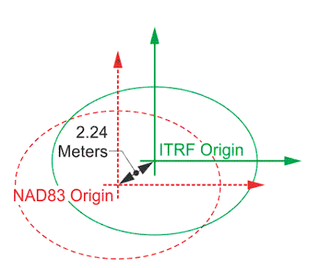

## Objectives

Now that you know how to read in some spatial data, we'll spend a bit of time learning the `sf` and `terra` syntax for accessing and changing the projection, extent, and resolution. By the end of this lesson, you should be able to:

1. Access the current CRS, extent, and resolution of a spatial data object

2. Use `sf` and `terra` to modify 1 spatial attribute or all 3 at once

3. Align vector and raster data for analysis and combination


## Getting Started

First, [join the repository](https://classroom.github.com/a/XWzfBM16). Then, we'll have to [get our credentials](https://rstudio.aws.boisestate.edu/) and login to a [new RStudio session](https://rstudio.apps.aws.boisestate.edu/). Finally, create a new, version control, git-based project (using the link to the repo you just created). 

Once you've done that, you'll need to load your packages. We're going to use the same packages as last time and source our custom download function.

```{r ldpkg}
library(googledrive)
library(sf)
library(terra)
library(tidyterra)
library(tidyverse)
source("scripts/utilities/download_utils.R")
```

## Some Context

You likely noticed in your quick maps that the two datasets look different. Sure, one is a vector with lots of `POLYGON` elements and the other is a raster (stored as a `SpatRaster`). If you looked a little, you probably noticed that the orienation (angle) of the areas was a bit different. If you looked a little harder, you probably saw that the general shapes of the states is a bit different, too. And, maybe if you squint, you can see that the boundaries of the maps looks a little different. We'll work through some ways of looking at and fixing those things today! Let's load our datasets and get started!

```{r dlld}
file_list <- drive_ls(drive_get(as_id("https://drive.google.com/drive/u/1/folders/1PwfUX2hnJlbnqBe3qvl33tFBImtNFTuR")))[-1,]


file_list %>% 
  dplyr::select(id, name) %>%
  purrr::pmap(function(id, name) {
    gdrive_folder_download(list(id = id, name = name),
                           dstfldr = "inclass08")
  })

cejst_shp <- read_sf("data/original/inclass08/cejst.shp")
fire_prob <- rast("data/original/inclass08/wildfire.tif")
```


## What is the Current Extent?

Because extent is part of our internal definition of scale and because getting our extents aligned is a big part of making sure our data sandwich doesn't fall apart, we'll start by checking to see what the extent is for each dataset.

### Vector Data
By convention, the `sf` package uses a standard syntax for spatial operations that starts with `st_`. In addition, the extent of a vector dataset is known as the **bounding box**. We can access that using `st_bbox`


```{r sfbbox}

st_bbox(cejst_shp)

cejst_shp %>% 
  filter(., SF == "Idaho") %>% 
  st_bbox()

```
There are three things to know about the bounding box. First, it is, by definition, a rectangle that encompases the vertices of your vector object. So, even if you've got an irregularly shaped `POLYGON` or a series of `POINTS`, the bounding box  necessarily returns the rectangle that encompasses all of the vertices in the object.  Second, using `st_bbox` returns an object of class `bbox` (you can check this by running `st_bbox(your_data) %>% class()` which is a special kind of object. Finally, if you use `dplyr` verbs to alter your the composition of your vector dataset, the bounding box will update to reflect those changes. You can see that in the values returned in the example above, but you can also plot it.

To do that, we have to convert the `bbox`to a simple feature collection (`sfc`) we can do that using the `st_as_sfc` command and then use base `plot` to give us a sense for how different the two bounding boxes are.

```{r pltbbox}
all_bbox <- st_bbox(cejst_shp) %>% 
  st_as_sfc()
id_bbox <- cejst_shp %>% 
  filter(., SF == "Idaho") %>% 
  st_bbox() %>% 
  st_as_sfc()

plot(all_bbox)
plot(id_bbox, add=TRUE, border ="red")
```


One nice thing about `sf` objects is that there is a built-in `geom_` in `ggplot2` that will allow us to make maps with all of the flexibility of `ggplot`. 

```{r ggbbox}

ggplot() +
  geom_sf(data = all_bbox, color = "yellow", fill = "darkorchid4") +
  geom_sf(data= id_bbox, fill = "orangered") +
  theme_bw()

```

In the `ggplot` call, I've done several things. First, I used `geom_sf` to add each vector dataset. Then instead of using the `mapping = aes()` to tell `ggplot` which column I want to use for the colors, I set the `color` and `fill` manually by specifying them outside of the `aes()` call and setting them manually.  Finally, I called `theme_bw()` to set the plotting options [using one of the preset `ggplot` themes](https://r-charts.com/ggplot2/themes/). Using `ggplot` gives a lot more flexibility and allows us to layer data on top of each other to create maps!


### Raster Data

Unfortunately, the `terra` package uses some different conventions and `tidyterra` only provides functionality for some operations that are more complex. That said, many of the functions in `terra` match our intuition for the operations we'd like to use so it doesn't take too much to figure out how to get what we need. In this case, we are interested in the **extent** of our raster.  If you look at the `terra` helpfile (`?terra`), you'll see the entire list of functions available within the package. If you look for the "Getting and setting dimensions" section, you'll see that there are a number of functions for getting information about `SpatRaster` objects. A quick scan reveals that the function for getting the extent is `ext`.

```{r terext}
ext(fire_prob)

```

You'll notice a few things about this object. First, it has a new `class`, a `SpatExtent`. Next, you'll notice that the ordering and structure of the data is different from that of `sf`'s `bbox`. 

We can use `plot` directly on a `SpatExtent` object to be able to look at the extent.

```{r plotext}
plot(ext(fire_prob), border = "red")
plot(fire_prob, add=TRUE)
```

Similar to the `bbox` from `sf`, `ext` returns a rectangle encompassing the entire `SpatRaster` object. The `tidyterra` package allows us to use `filter` as a way to subset rasters without using indexing. We can use that here to find all of the cells whose wildfire hazard potential is greater than 30000. While the behavior of `filter` is the same for both `sf` and `terra` (meaning it keeps only the values that meet your `filter` criteria), you'll notice that, unlike the `bbox` of `sf`, the extent of a `SpatRaster` does not change to match the subset data. 

```{r subrst}

fire_subset <- fire_prob %>% 
  filter(WHP_ID > 30000)

plot(ext(fire_subset), border = "red")
plot(fire_subset, add=TRUE)

```

## How Can I Change the Extent?

There may be occasions where you want to manually change the extent of your spatial objects. Both `sf` and `terra` provide multiple functions for changing the `extent` as part of additional spatial operations (we'll talk more about this in the coming weeks), but sometimes you might want to adjust the extent of an object without modifying anything else about it. Sometimes we might do this to create inset maps. Sometimes we might want to create asymmetric buffers around an existing extent. This is a somewhat rare, but it's worth knowing how to do it just to get a feel for how extents work.

### Vector Data

If you look at `?st_bbox` you'll see an example of the manual creation of a `bbox` object. We can exploit the fact that `st_bbox` returns a `named.vector` to access the values in the original bounding box and "shrink" it by adding (or subtracting) values from the existing bounding box. Two things are tricky here. First, the original data is in a **geodetic** projection so the units are in degrees (which I have no real intuition for). Second, the goal of "shrinking" the bounding box means we have to think about how we might move "up" or "in" along the graticules. I exploited the plot above to figure out some reasonable numbers and add them here. 

```{r chgbbox}
orig_bbox <- st_bbox(cejst_shp)

new_bbox <- st_bbox(c(orig_bbox["xmin"] + 1, orig_bbox["xmax"] - 1,  orig_bbox["ymax"] - 1, orig_bbox["ymin"] + 1), crs = st_crs(orig_bbox)) %>% st_as_sfc()
```

You can verify this again with a plot.

```{r bboxchg}

ggplot() +
  geom_sf(data = st_as_sfc(orig_bbox), color = "yellow", fill = "darkorchid4") +
  geom_sf(data= new_bbox, fill = "orangered") +
  theme_bw()
  
```  

### Raster Data

The process is similar for rasters with `terra`, but we need to get the `SpatExtent` object into a more useable format. The other thing to notice is that our raster is in a projection that uses meters as its measurement unit (you can tell by the differene in the orders of magnitude in the values). This means we need to think a bit differently about how to shift the box.

```{r chgext}

orig_ext <- as.vector(ext(fire_prob))

new_ext <- ext(as.numeric(c(
  orig_ext["xmin"] + 100000,
  orig_ext["xmax"] - 100000,
  orig_ext["ymin"] + 100000,
  orig_ext["ymax"] - 100000
)))

plot(orig_ext)
plot(new_ext, add=TRUE, border = "red")

```

## What is the Current Resolution?

For vector datsets, we don't tend to think about resolution because vectors can be stretched or subset. Instead, we need to think about the **support** underlying the data. This isn't readily apparent in the data itself. Instead, you'll need to look into the metadata or the sources of the data to understand what the "true" resolution of the data is.

For raster data, this is easy enough using the `res` function in `terra`

```{r terres}
res(fire_prob)
```

## How Can I Change the Current Resolution?

In some cases you may want to sharpen or coarsen the resolution. You can use `aggregate` or `disagg` in `terra` to do this. The key bit is the `fact` argument. Which tells you the factor by which we create that surface.

```{r reschg}
coarser_fire <- aggregate(fire_prob, fact = 5)
finer_fire <- disagg(fire_prob, fact = 5)

res(coarser_fire)
ext(coarser_fire)
res(finer_fire)
ext(finer_fire)
plot(coarser_fire)
plot(finer_fire)
```


## What is the Current Projection?
You probably noticed from your initial plots that the "shapes" of the data are different. This is a pretty good clue that the data is in different projections. We can verify that relatively easily in both `sf` and `terra`.

### Vector Data

When we are considering projections, our true interest is in the Coordinate Reference System (CRS). For `sf` we can use `st_crs` to access the CRS for a vector object.

```{r sfcrs}
st_crs(cejst_shp)

```

You'll notice a fairly verbose output from this. This is a `.wkt`(well-known text) output that describes all of the parameters underlying the projection (here it's WGS84). You'll notice in the last line that there is "EPSG" code. EPSG stands for European Petroleum Survey Group, an entity that standardizes codes and parameters for projections. These codes can be used as shorthand in `R` to alter projections so that you don't have to know all of the .wkt parameters.

### Raster Data
The process is largely the same for `terra`, but without the `st_` prefix.
```{r crsrst}
crs(fire_prob)
```

Here again, you get the .wkt output, but it's in a slightly different format. This makes difficult to compare projections programmatically. Instead you've got to look to see if things match. One thing you'll notice is that the wkt says "unnamed" suggesting that `R` isn't entirely sure what this is. However, all of the necessary parameters are there, so we'll move on for now.

## How Can I Change the Projection?
In order to make sure that our "data sandwich" is lined up that any combinations of data we create truly correspond to the same location. We can **reproject** the data to ensure alignment. In `sf`, we can use `st_transform` to _transform_ the CRS of a spatial layer.

::: {.callout-warning}
In general, it is better to re-project vector data to match raster data, as the vector form is more flexible (because vectors can stretch, but raster cells can't).
:::

### Vector Data

Let's start by reprojecting the vector dataset. 
```{r rprjvect}

cejst_reproject <- cejst_shp %>% 
  st_transform(., crs = st_crs(fire_prob))
```

The `st_transform` function is the reprojection function. The `.` tells `st_transform` to project the object that is piped (` %>% `) in and the `crs` argument tells the function what the new Coordinate Reference System should be. You'll notice here that we used `st_crs` to extract the CRS from our raster dataset. For several common functions (like accessing CRS), `sf` will accept `terra` objects and vice versa. This is not generally the case, though, and if we need to use `terra` to work on vector data we'll need to convert our `sf` object to a `vect` object using `terra`'s `vect()` function.

Now let's look at what's changed about the vector data.

```{r vectchg}
st_crs(cejst_reproject)
st_crs(cejst_shp)
st_bbox(cejst_reproject)
st_bbox(cejst_shp)
```
### Raster Data

Even though it's not a particularly great idea, we can reproject the raster to match our existing shapefile too. You can learn more about this from `?project`. You'll also notice that there are a number of recommendations to help you do this safely and without breaking something.

For this to work, we need to get the crs from our data in a format the `terra` can understand. Unlike `sf`, `terra` relies primarily on the wkt form (instead of epsg), so we get that first. Then we can use `terra`s `project` function. We'll do more projecting and resampling of rasters in the coming weeks, but for now it's worth understanding the mechanics and reading the helpfile to understand the limitations of approaching it this way.

```{r rstprj}


target_crs <- st_crs(cejst_shp)$wkt  # WKT string

fire_reproj <- project(fire_prob, target_crs)

crs(fire_reproj)
crs(fire_prob)
ext(fire_reproj)
ext(fire_prob)
res(fire_reproj)
res(fire_prob)

```

This is a pretty good indication of the impacts of moving from a degree-based CRS to one that relies on meters. On the one hand, we can express location with smaller values (we learn more from less) with the degree-based CRS. On the other hand, it's almost impossible to reason about how big a 0.002 degree square pixel is....

## A Final Note on Making Tabular Data Spatial

One thing that happens fairly regularly is that we get a spreadsheet with coordinates that isn't otherwise spatial. The PurpleAir data that we used in the last unit is a great example of this. The sensor information data comes with info about the sensors along with the latitude and longitude for each sensor.

We can make this spatial (and maybe even start to think about smoke in the context of both fire probability and social vulnerability). But how do we do that?? The first clue is that the coordinates are in latitude and longitude. This tells us that we are dealing with a geocentric reference system (or datum) - that is, one that has not been projected and provides estimates around the globe. But which one do we use??

As we discussed, NAD83 is a local datum, one designed such that the spheroids (lines of latitude and longitude) fit the earth's surface well in _a particular location_. Alternatively, WGS84 and ITRF2014 are geodetic datums meaning that they offer a more uniform and extensive coverage for the entirety of the globe (even if less accurate for a particular location). 

One of the primary differences in geodetic and local datums is how they account for earth's movement. For the NAD83 datum, the reference point is fixed to the North American tectonic plate and only moves in association with the movement of that plate. WGS84 and ITRF2014 account for the fact that all of the earth's tectonic plates are moving and moving at different rates, hence differences arise (slowly) between the different datums as the earth moves.



Assigning anyone of of these datums is relatively trivial computationally so we'll try all 3. We'll use `read_csv` to get the tabular data, convert it using `st_as_sf`, provide the columns with the location information for the `coords` argument, and provide the epsg code for each datum to the `crs` argument.

```{r tabdata}

pa_locations_wgs <- read_csv("data/original/inclass08/pa.csv") %>% 
  st_as_sf(.,
           coords = c("longitude", "latitude"),
           crs = 4326) 


pa_locations_nad <- read_csv("data/original/inclass08/pa.csv") %>% 
  st_as_sf(.,
           coords = c("longitude", "latitude"),
           crs = 4269)

pa_locations_itrf <- read_csv("data/original/inclass08/pa.csv") %>% 
  st_as_sf(.,
           coords = c("longitude", "latitude"),
           crs = 7789)
```

It's difficult to inspect these with plots because `ggplot` expects the data to be in a single CRS (because that's how we should make maps). Instead, we can take a look at things like the `bbox` to see how big of a difference this makes.

```{r bboxpts}
st_bbox(pa_locations_wgs)
st_bbox(pa_locations_nad)
st_bbox(pa_locations_itrf)


```

As you can see, given the level of precision that we are reporting and the relatively small amount of movement a tectonic plate undergoes in year, the differences are not particularly obvious in the small window that we are looking at. We'll play with these things more in the coming weeks. For now, it should be enough that you've learned to convert the tabular dataset to a set of `POINTS`