```{r}
knitr::opts_chunk$set(dev.args = list(bg = "transparent"))
```

# Welcome to Space!! {background="#9F281A" background-image="img/slide_1/Helix_Nebula.jpeg"}

::: footer 
:::{style="font-size: 0.8em; margin-bottom: -1.5em; color:#fff"}
image courtesy of NASA/JPL-Caltech/Univ. of Ariz., Public domain, via Wikimedia Commons
:::
:::

## Today's Plan {background="#9F281A" background-image="img/slide_1/Helix_Nebula.jpeg"}

:::{style="font-size: 1.2em; text-align: middle; margin-top: 2em"}
- Introductions

- What can we do with spatial data?

- Course logistics and resources

- Testing out RStudio and GitHub Classroom
:::

# Introductions {background="#440065"}

## About you? { background-image="img/slide_1/camasprairie.jpeg" background-opacity="0.8"}
:::{style="font-size: 1.2em; text-align: center; margin-top: 2em"}
:::{style="color: #FFFF"}
- Your preferred pronouns

- Where are you from?

- What do you like most about Boise? 

- What do you miss most about "home"?

- What is your research?
:::
:::

## About Me

::: columns
::: {.column width="40%"}

-   What I do

-   My path to this point

-   Why I teach this course

:::
::: {.column width="60%"}
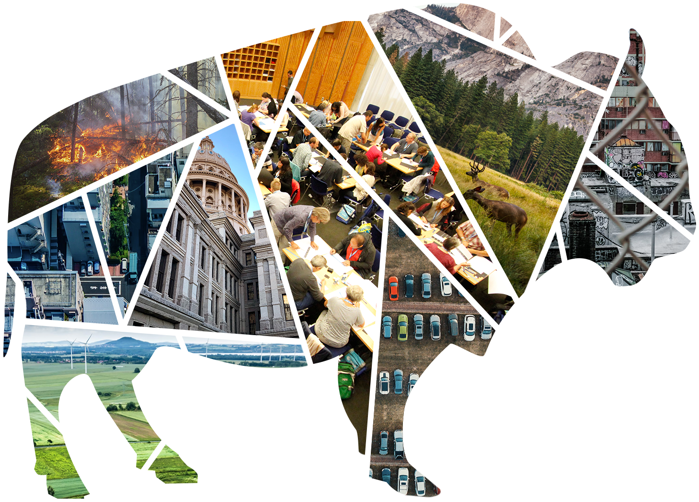
:::
:::


# What can we do with spatial data? {background-image="img/slide_2/iceberg.jpeg" background-opacity="0.6"}

## What is geography

- **Geo**: land, earth, terrain

- **Graph**: writing, discourse

- Tuan: **Space** (extent) and **Place** (location)

- Analysis of the effects of extent and location on events or features

## Five Themes in Geography
::: columns
::: {.column width="40%"}
- Location

- Place

- Region

- Movement

- Human-Environment Interaction
:::
::: {.column width="60%"}
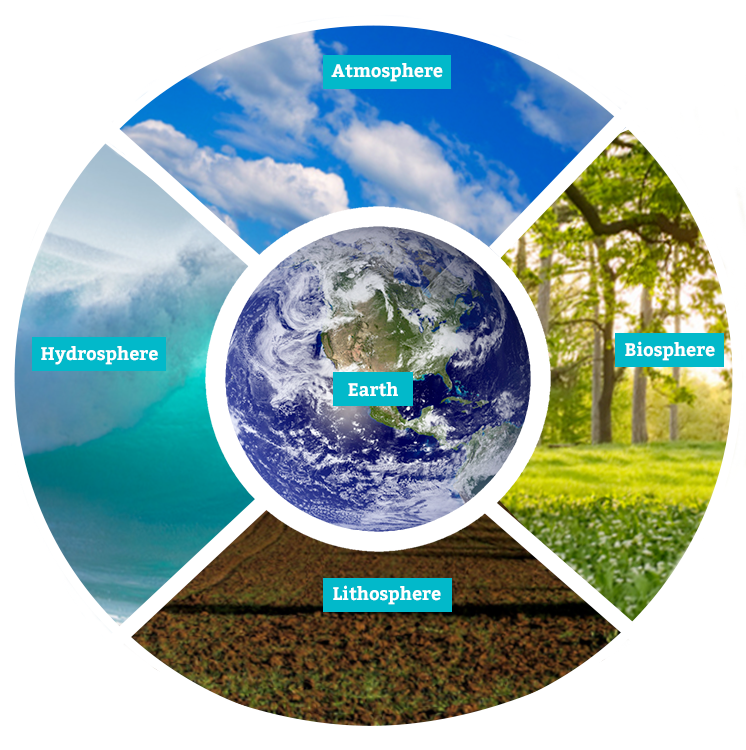
:::
:::

## Location
The place (on Earth) of a particular geographic feature

<div style="display: flex; justify-content: center; gap: 2em;">
  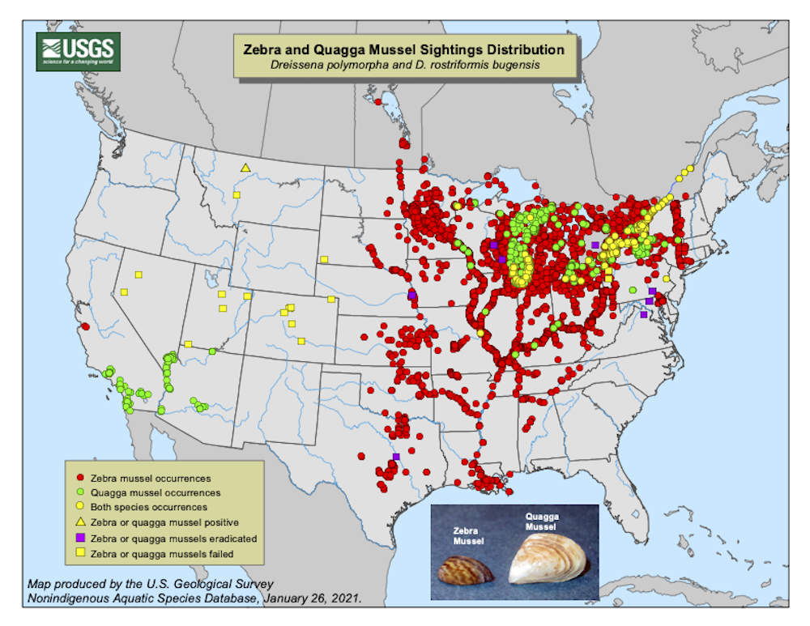
  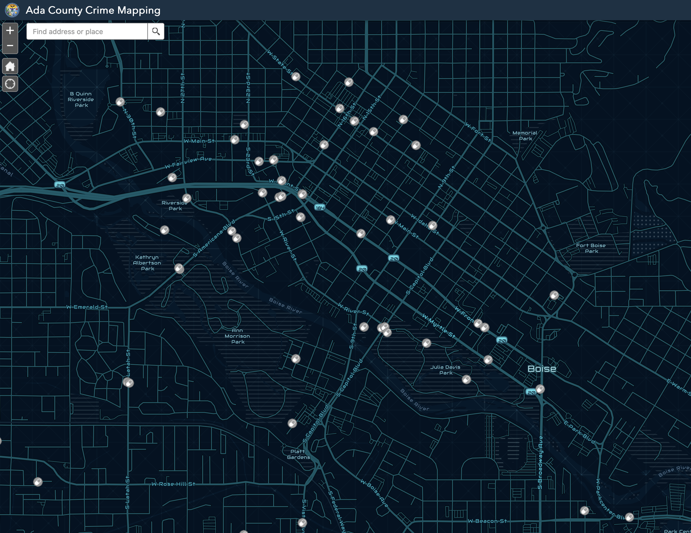
</div>

## Place
What is a location _like_?

<div style="display: flex; justify-content: center; gap: 2em;">
  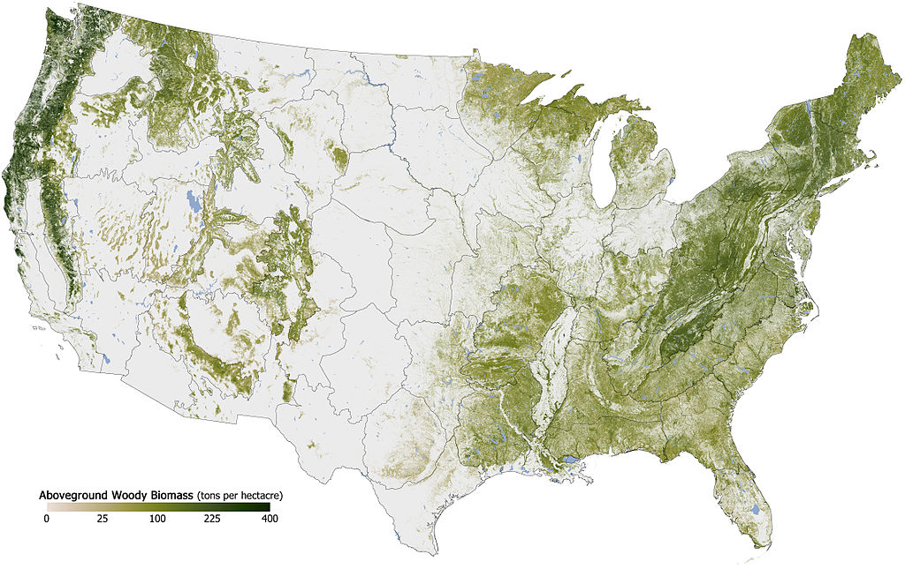
  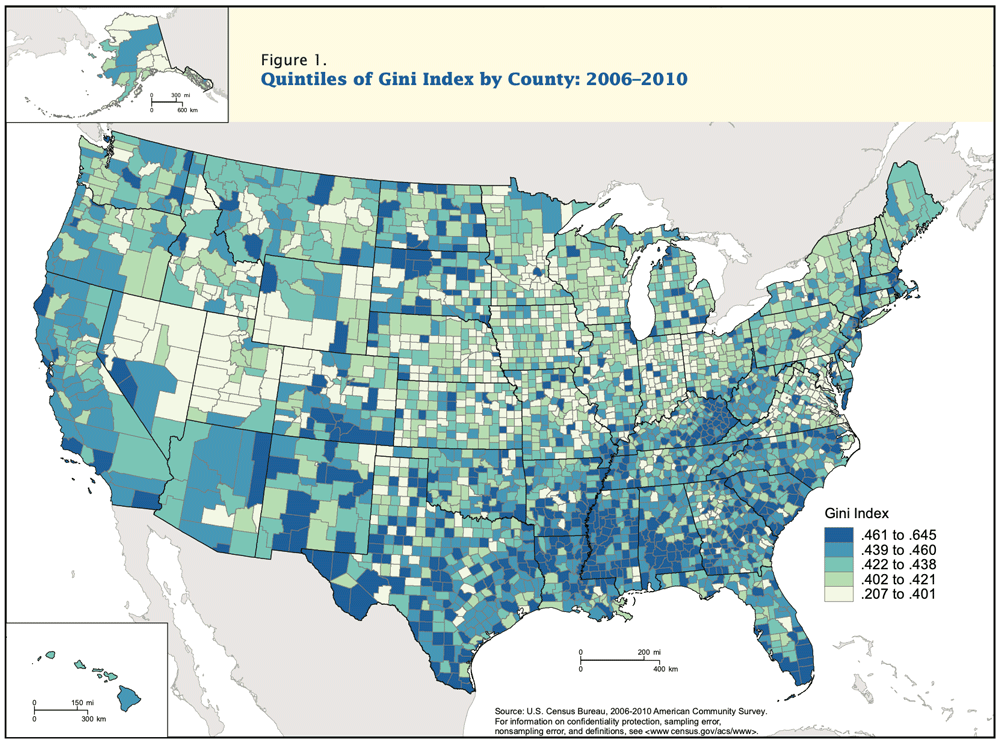
</div>


::: footer 
:::{style="font-size: 0.8em; margin-bottom: -1.em; color:#fff"}
Forest cover map by Robert Simmons via Wikimedia Commons 
:::
:::


## Region
What attributes to different geographies share? What distinguishes them?

<div style="display: flex; justify-content: center; gap: 2em;">
  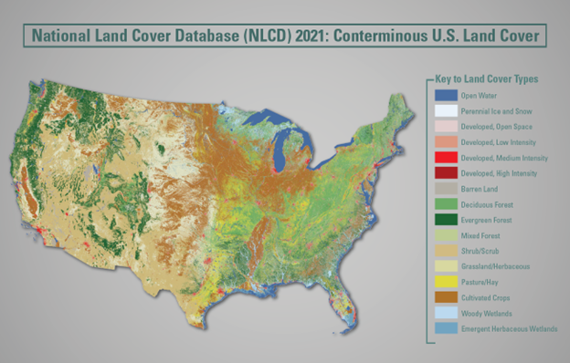
  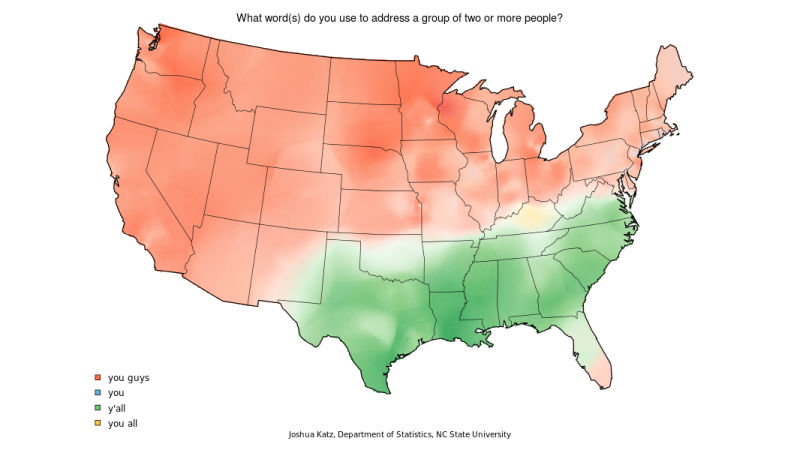
</div>


## Movement
How do genes, individuals, populations, ideas, goods, etc traverse the landscape.

<div style="display: flex; justify-content: center; gap: 2em;">
  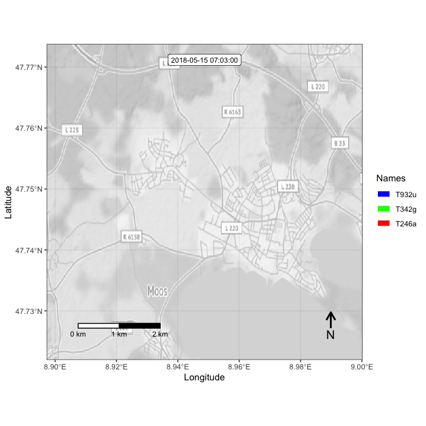
  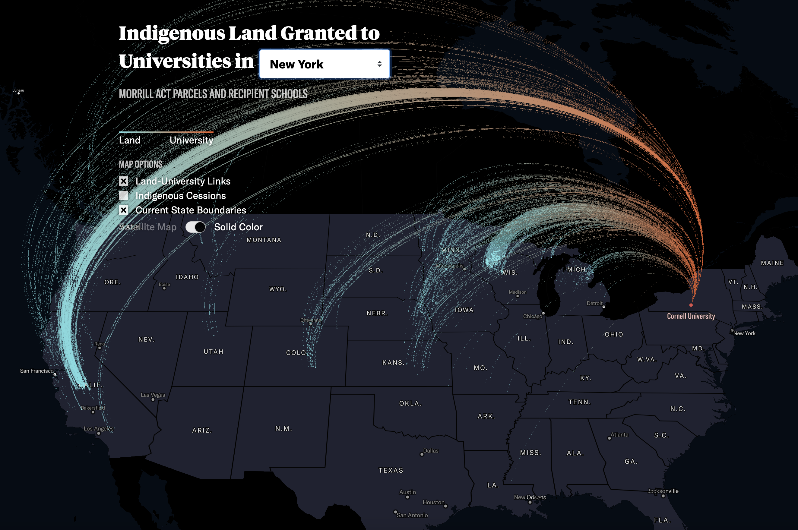
</div>

::: footer 
:::{style="font-size: 0.8em; margin-bottom: -1.em; color:#fff"}
LandGrab maps courtesy of High Country News
:::
:::

## Human-Environment Interactions
How do people relate to and change the physical world to meet their needs?

<div style="display: flex; justify-content: center; gap: 2em;">
  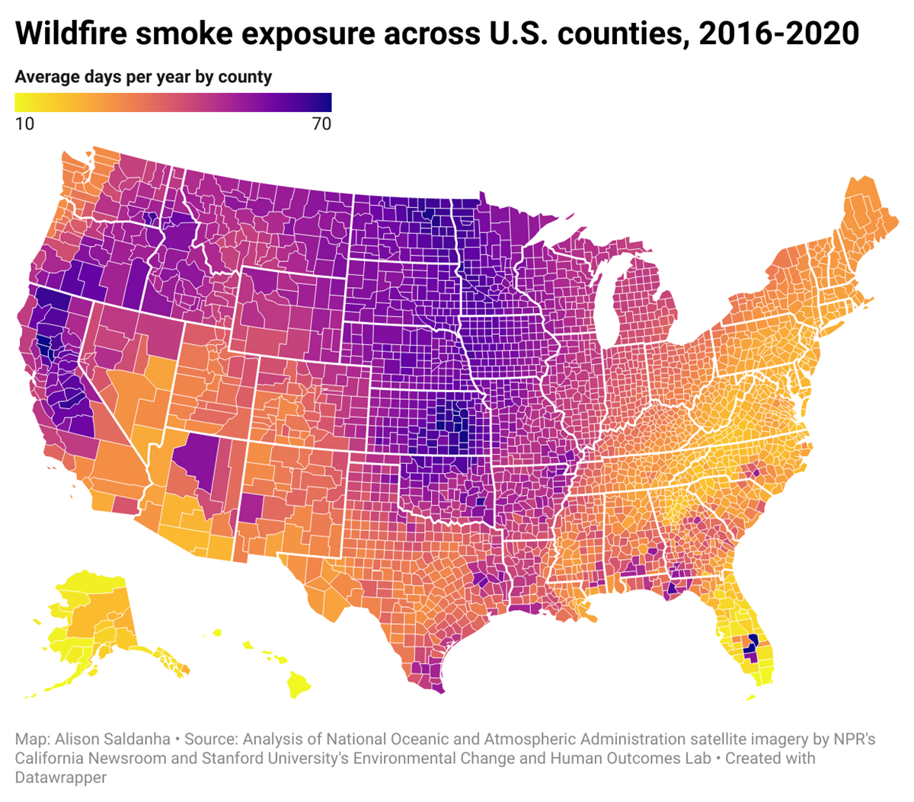
  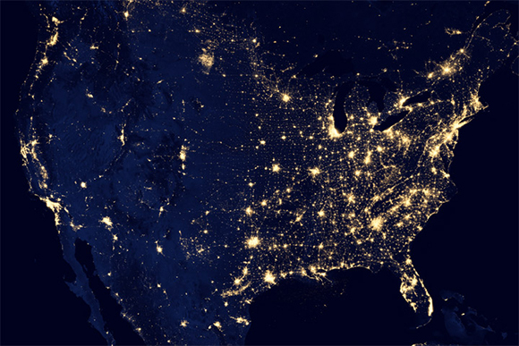
</div>

::: footer 
:::{style="font-size: 0.7em; margin-bottom: -0.80em; color:#fff"}
Smoke map courtesy of Capital Public Radio; Nightlights courtesy of NASA Earth Observatory.
:::
:::

# {background="#44006"}
:::{style="font-size: 1.4em; text-align: middle; margin-top: 2em"}
Towards _quantitative_ spatial analysis
:::

# {background="#44006"}
:::{style="font-size: 1.4em"}
> ‘everything is usually related to all else but those which are near to each other
>are more related when compared to those that are further away’.
> `r tufte::quote_footer('Waldo Tobler')`
:::

# 3 "Faces" of Analysis

```{r}
#| echo: false
#| message: false
#| crop: true
#| fig-align: center

library(ggplot2)
D <- list("Description" = c(2, 3, 1), "Explanation" = c(4, 7, 1), "Prediction" = c(7, 5))

p <- ggvenn::ggvenn(D, c("Description", "Explanation", "Prediction"),
  show_percentage = FALSE,
  show_elements = FALSE,
  fill_color = c("#dfbbc8", "#ffc680", "#db8872"),
  fill_alpha = 0.7,
  set_name_color = "white",
  text_size = 0.0001,
  show_outside = "none"
)

p2 <- p + theme(
  panel.border = element_rect(color = "#440065", fill = "transparent"),
  panel.background = element_rect(fill = "#440065", color = "#440065"),
  plot.background = element_rect(fill = "#440065"),
  panel.grid.major = element_blank(),
  panel.grid.minor = element_blank()
)
# ggsave("venn.png", p2, bg="transparent", width=6, units = "in")
p2
```


## Description

<div style="display: flex; justify-content: center; margin-top: -0.8em">
  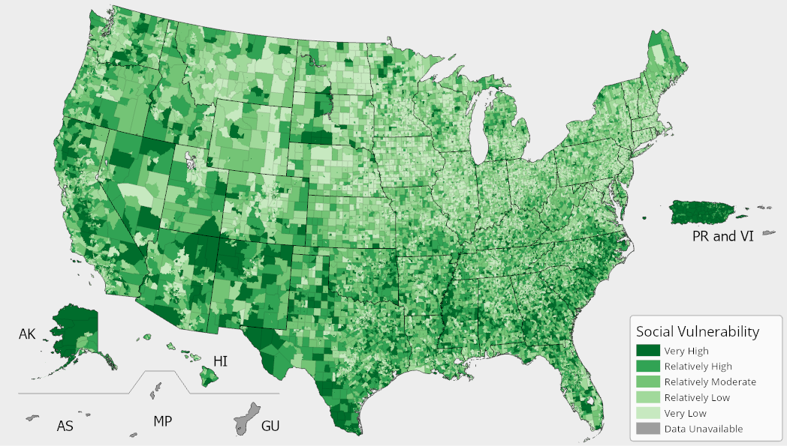
</div>

:::{style="font-size: 0.8em; text-align: left; margin-top: -1.4em; margin-bottom: -0.8em;"}


::: columns
::: {.column width="60%"}
- Coordinates
- Distances
- Neighbors
- Summary statistics

:::
::: {.column width="40%"}
- Range Maps
- Hotspots
- Indices
:::
:::
:::

## Explanation and Inference
:::{style="font-size: 0.85em; text-align: left; margin-top: -0.5em; margin-bottom: -0.8em;"}
- **Cognitive Description**: collection ordering and classification of data

- **Cause and Effect**: design-based or model-based testing of the factors that give rise to geographic distributions

- **Systems Analysis**: describes the entire complex set of interactions that structure an activity
:::

<div style="display: flex; justify-content: center; margin-top: -0.9em">
  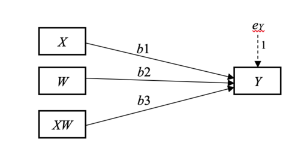
</div>


## Prediction

::: columns
::: {.column width="60%"}
<div style="display: flex; justify-content: center; margin-top: -0.9em">
  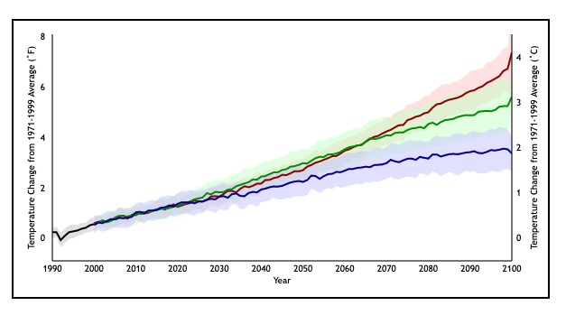
</div>

:::
::: {.column width="40%"}
:::{style="font-size: 0.85em; text-align: left"}

- Extend description or explanation into unmeasured space
- Stationarity: the rules governing a process do not _drift_ over space-time
:::
:::
:::


# Class Details {background="#440065"}

## Logistics { background-image="img/slide_1/bison.jpeg"}

:::{style="font-size: 1.2em; text-align: center; margin-top: 2em; color:#fff"}
- Meet on Mondays and Wednesdays 

- ~40 min lecture, 30 min practice 

- 5 major sections

- A note about readings 

"Office Hours" immediately following class
:::

## Course Webpage { background-image="img/slide_1/hellroaring.jpeg"}

[https://isdrfall25.classes.spaseslab.com/](https://isdrfall25.classes.spaseslab.com/){ style="font-size: 1.2em; text-align: center; margin-top: 2em; color:#fff"}

:::{style="margin-top: 1.5em; color: #fff"}
- Syllabus

- Schedule

- Lectures

- Assignments

- Resources
:::

## Assignments
::: {style="font-size: 1.2em; text-align: center"} 
**Check out the syllabus for more on grading!**
:::
:::{style="font-size: 0.8em"}

::: columns
::: {.column width="50%"}
- **Self-reflections** (2x)
  - Your goals for the course
  - Evaluation criteria


- **In-class exercises** (30x)
  - Problem solving
  - Reproducible workflows
  - Muscle memory
:::
::: {.column width="50%"}
- **Homework Assignments** (5x)
  - Integrate skills from the section
  - Practice visualization
  - Build version control habits

- **Code Revisions** (5x)
  - Common issues
  - More extensive feedback
  

::: 
:::
:::
:::{style="font-size: 0.8em; text-align: center; margin-top: -0.95em; margin-bottom: -0.8em;"}
- **Final project** (1st draft, final draft): Practice a full analysis workflow; Integrate analysis & visuals to tell a story
:::


# Wrapup {background="#440065"}

## Checking in

1. What can I clarify about the course?


# End { background-image="img/slide_1/Kepler-world.jpeg" background-opacity="0.7"}
::: footer 
:::{style="0.8em; margin-bottom: -1.5em; color:#9F281A"}
Johannes Kepler, 1627, Public domain, via Wikimedia Commons
:::
:::
