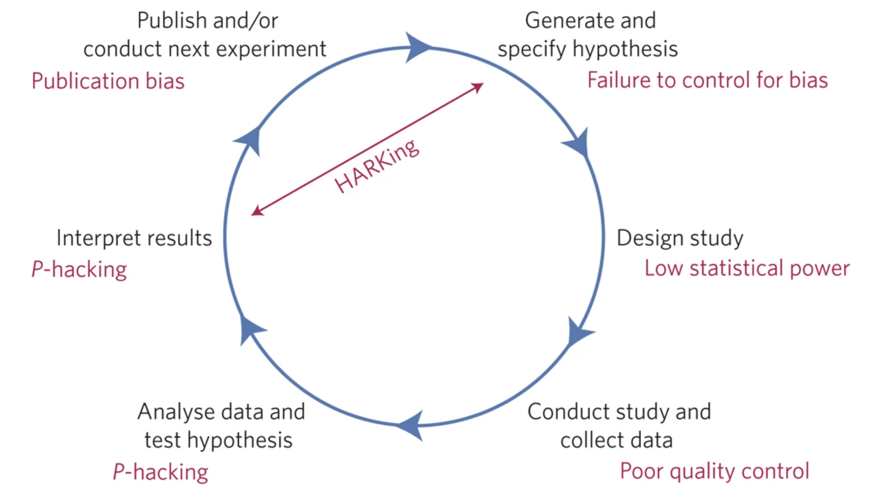

```{r}
#| echo: false
knitr::knit_hooks$set(crop = knitr::hook_pdfcrop)
library(tidyverse)
```
## Checking in

1. What can I clarify about the course?

2. Are there any challenges you can already see?


## Today's Plan {background-image="img/slide_2/hudbay.jpeg" background-opacity="0.6"}

:::{style="font-size: 1.4em; text-align: middle; margin-top: 2em"}

- Open Science, reproducibility, and R

- What is a (spatial) data workflow?

- Version control for fun and profit

:::

# A More Democratic Science? {background="#440065"}

## What is open science?

::: columns
::: {.column width="30%"}
::: {style="margin-left: -3em; font-size: 1.05em"}
- Scientific research and its outcomes freely accessible to all

- Accelerate research **AND** improve public trust

- Our focus: [Open source software and code]{style="color:#db8872;"}
:::
:::
:::{.column width="70%"}
<div style="display: flex; justify-content: right; margin-top: -4.5em; 
margin-right: -6.0em">
  <figure>
  
  <figcaption style="font-size: 0.6em; margin-top: -4em"><a href="https://commons.wikimedia.org/wiki/File:UNESCO-Open_science-pillars-en.png">UNESCO.org</a>, <a href="https://creativecommons.org/licenses/by-sa/4.0">CC BY-SA 4.0</a>, via Wikimedia Commons</figcaption>
  </figure>
</div>

:::
:::

## Why open source software and code?

- Future-proof: OSS development is fast and ongoing

- Interoperability: Work across hardware types, integrate new software easily

- Free!! (To use and maintain)

- Sharing code and data enables innovation and _reproducibility_


## Why (not) R?

::: columns
::: {.column width="50%"}
::: {style="margin-left: -3em;"}

{style="image-align:center"}

-   Open Source

-   Huge useR community

-   Integrated analysis pipelines

-   [Reproducible workflows]{style="color:#db8872;"}

:::
:::
::: {.column width="50%"}
{style="image-align:center"}

-   Coding can be hard...

-   Memory challenges

-   Speed

-   Decision fatigue
:::
:::

## Anatomy of an `R` session 

::: columns
::: {.column width="30%"}
::: {style="margin-left: -3em; font-size: 0.9em;"}
- Moving beyond **R**ead-**E**val-**P**rint **L**oops

- `scripts`: contain a record of the code in your analysis and the _objects_ you created

- `functions`: perform operations on objects

- `packages`: collections of related functions

:::
:::
::: {.column width="70%"}
::: {style="margin-right: -3em;"}
::: panel-tabset
### Code

```{r}
#| echo: true
library(maps)
library(socviz)
library(tidyverse)
party_colors <- c("#2E74C0", "#CB454A") 
us_states <- map_data("state")
election$region <- tolower(election$state)
us_states_elec <- left_join(us_states, election)
p0 <- ggplot(data = us_states_elec,
             mapping = aes(x = long, y = lat,
                           group = group, 
                           fill = party))
p1 <- p0 + geom_polygon(color = "gray90", 
                        size = 0.1) +
    coord_map(projection = "albers", 
              lat0 = 39, lat1 = 45) 
p2 <- p1 + scale_fill_manual(values = party_colors) +
    labs(title = "Election Results 2016", 
         fill = NULL)
```

### Plot

```{r}
#| echo: false
p2
```
:::
:::
:::
:::

# Reproducible workflows

#

> Science is a social process!!

## Why Do We Need Reproducibility?

::: columns
::: {.column width="20%"}
::: {style="margin-left: -3em"}
- Noise!!

- Confirmation bias

- Hindsight bias
:::
:::
::: {.column width="80%"}
<div style="display: flex; justify-content: center; margin-top: -0.9em; margin-right: -3.0em">
  
</div>
:::
:::

::: footer 
:::{style="font-size: 0.8em; margin-bottom: -1.em; text-align: right; color:#fff"}
Munafo et al. 2017. Nat Hum Beh.
:::
:::

## What do we mean by reproducible "workflow"?


## Reproducibility and your code

- Scripts: may make your code reproducible (but not your analysis)

- Commenting and [formatting](https://style.tidyverse.org/index.html) can help!

- Think about future you...

```{r}
#| echo: fenced
#| eval: false
## load the packages necessary
library(tidyverse)
## read in the data
landmarks_csv <- read_csv("/Users/mattwilliamson/Google Drive/My Drive/TEACHING/Intro_Spatial_Data_R/Data/2023/assignment01/landmarks_ID.csv")

## How many in each feature class
table(landmarks_csv$MTFCC)

```

## Reproducible scripts

- Comments explain what the code is doing

- Operations are ordered logically

- Only relevant commands are presented

- Useful object and function names

- Script runs without errors (on your machine and someone else's)


# Flipping the script

## Toward Efficient Reproducible Workflows

- Scripts can document what you did, but not why you did it!

- Scripts separate your analysis products from your report/manuscript

## What is literate programming?

- Documentation containing code (not vice versa!)

- Direct connection between code and explanation

- Convey meaning to humans rather than telling computer what to do!

## Why literate programming?

- Your analysis scripts **are** computer software

- Integrate math, figures, code, and narrative in one place

- Explaining something helps you learn it


# Introducing Quarto 

## What is Quarto?


::: {style="font-size: 1em; text-align: center;"} 
- End-to-End process between data and report

- Explicit linkage between each step (including iteration)

- Each step involves trials and choices
:::

## What is Quarto?

- A multi-language platform for developing reproducible documents

- A 'lab notebook' for your analyses

- Allows transparent, reproducible scientific reports and presentations

## Key components

1. Metadata and global options: YAML

2. Text, figures, and tables: Markdown and LaTeX

3. Code: `knitr` (or `jupyter` if you're into that sort of thing)

## For this class...

- We'll use headers to outline the analysis

- We'll use code chunks for small, self-contained operations

- We'll create our own functions for repeated operations

- We'll `knit` our documents into a standalone, readable document

# Version control, reproducibility, and sanity

## Version control in general

- Track changes without version explosion (via `git`)

- Create specific snapshots of a project to facilitate experimentation (via `commit` and `branches`)

- Create centralized backups and ease collaboration (via `GitHub`)

## Version control and reproducibility

- Documenting changes to code, manuscripts, figures increases transparency of the scientific process

- Collaboration with other programmers is easier and less risky

- Automates the sharing of code and original data

## Version control and sanity

- `commit` early, `commit` often

- use sensible messages to remind yourself where you were

- make sure you always have the most up-to-date version

- **It will take some practice to `git` comfortable**


 
