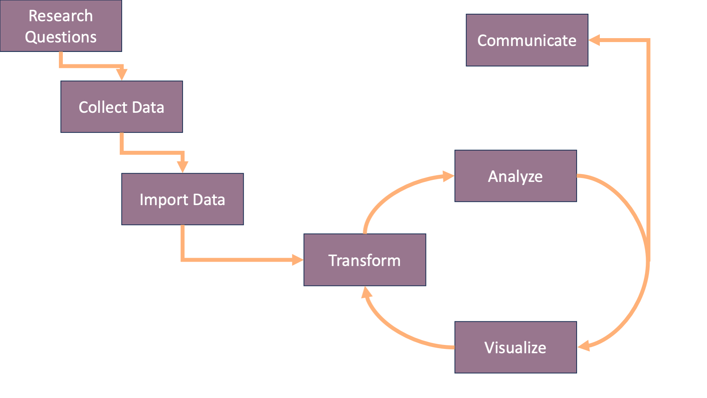
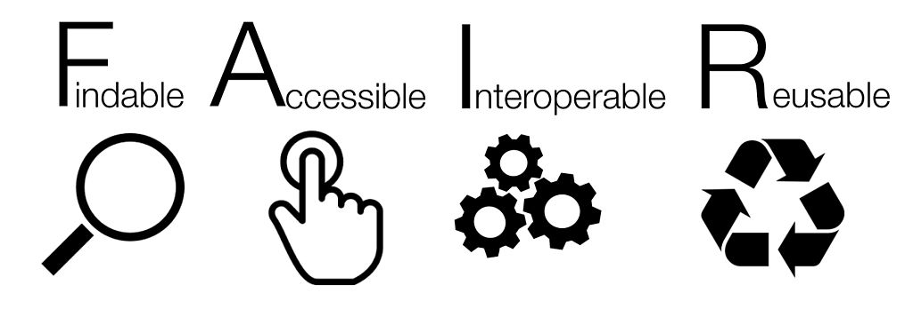
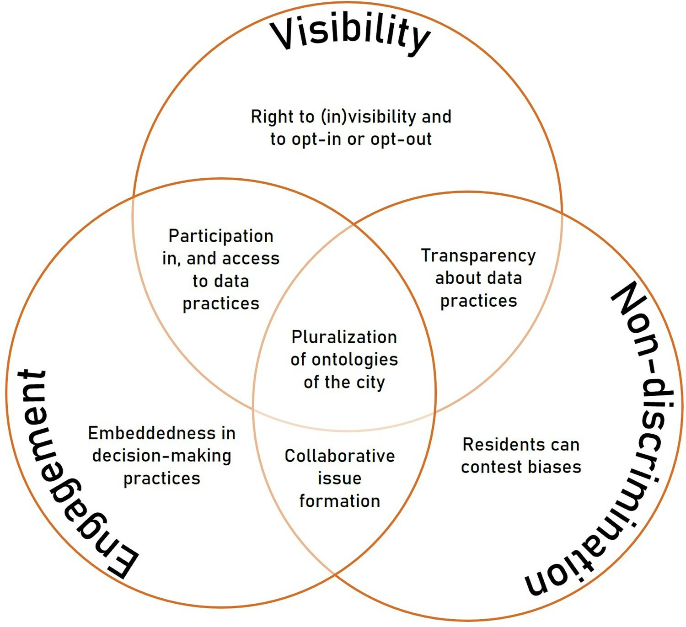
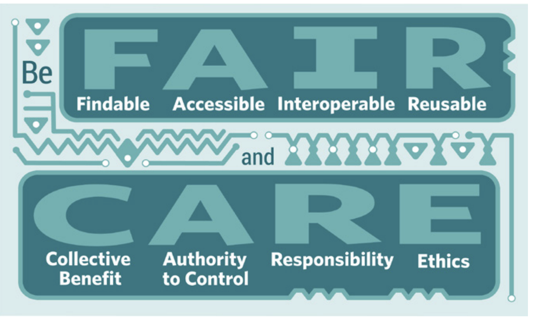

## Checking in

* Have you used the videos and lessons?

* How can I make them more useful?

* Anything I can clarify from last class?

## Today's Plan {background="#9F281A" background-image="img/slide_1/Helix_Nebula.jpeg"}

:::{style="font-size: 1.2em; text-align: middle; margin-top: 2em"}
- Data, information, and knowledge

- The elements of data quality

- Concerns with the growth in available data

- Towards data justice

:::

## Revisiting Workflows

  <figure>
  
  </figure>

::: {style="font-size: 1em; text-align: center;"} 
Get Data???
:::

##

  <figure>
  
  <figcaption style="font-size: 0.6em; margin-top: -1em"><a href="https://link.springer.com/article/10.1007/s00191-003-0181-9">Boisot and Canals, 2004</a></figcaption>
  </figure>

## 

> Observations become data through the filters we put on them

::: {.incremental}

* Our questions guide which observations we consider data

* But what about found data?

:::

## FAIR Data and Found Data

  <figure>
  
  <figcaption style="font-size: 0.6em; margin-top: -1em"><a href="https://roadtofair.hypotheses.org/47">Alvan&#xe7;o 2021</a></figcaption>
  </figure>

>FAIR data improves our ability to leverage existing data, but we haven't really reached this ideal.

## Most spatial data is "found" data

* Military advancement

* Enumeration of populations 

* Delineations of authority

## Making the invisible visible...

::: {.incremental}

  * Globalization of data resources
  * Data "traces" and policing
  * Bias in data &rArr; Bias in policy

:::

## Data Justice

>**Data Justice** promotes ethical and equitable practices in the collection, analysis, and use of data to serve the dignity, rights, and well-being of individuals and communities, especially those who have been historically marginalized
  
## Data Justice in Practice

  <figure>
  
  <figcaption style="font-size: 0.6em; margin-top: -1em"><a href="https://www.tandfonline.com/doi/full/10.1080/02681102.2022.2091505">Hoefsloot et al., 2022</a></figcaption>
  </figure>

## From FAIR to CARE

  <figure>
  
  <figcaption style="font-size: 0.6em; margin-top: -1em"><a href="https://www.gida-global.org/care">Global Indigenous Data Alliance</a></figcaption>
  </figure>

* FAIR is about access and documentation

* CARE is about sovereignty, governance, and justice

## Questions to ask yourself?

* Where did this data come from and why was it collected?

* How might the intention and biases of the collector affect the data?

* Who might benefit or suffer from this analysis and what do I owe them?

* Are there ways I can address this in my analysis or interpretation?

# ... but you have data!!

## ...but you have data!!

1. Documenting your data

2. Exploring your data

3. Doing both with Quarto
