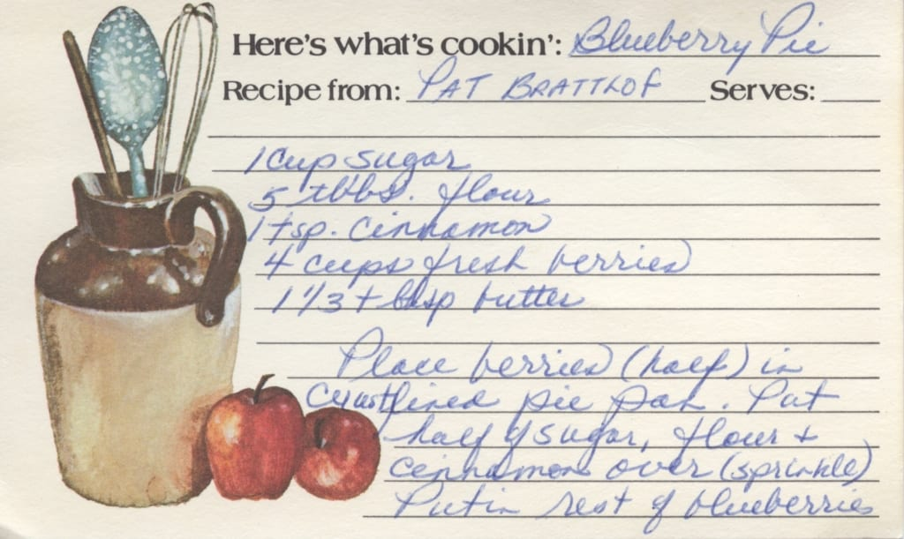
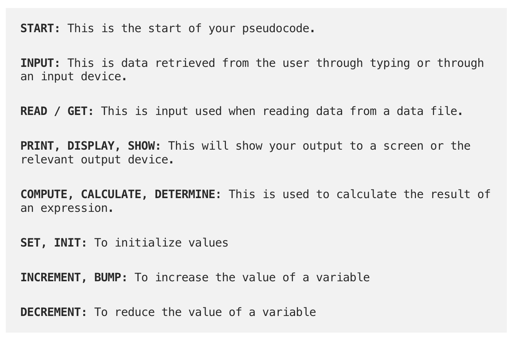

## What is literate programming?

- Documentation containing code (not vice versa!)

- Direct connection between code and explanation

- Convey meaning to humans rather than telling computer what to do!

## What is a script?

::: columns
::: {.column width="40%"}
 
 * Clarity
 
 * Automation
 
 * Minimal Documentation

:::
::: {.column width="60%"}


:::
:::

::: {style="font-size: 1em; text-align: center;"}
If it's for a computer, it's great for a script. If it's for a human, we need more.
:::

## Pseudocode 

- An informal way of writing the 'logic' of your program

- Balance between readability and precision

- Avoid _syntactic drift_ 

## Writing pseudocode

::: columns
::: {.column width="40%"}
- Focus on statements
- Mathematical operations
- Conditionals
- Iteration
- Exceptions
:::
::: {.column width="60%"}

:::
:::

## Pseudocode

```{r}
#| eval: false
#| echo: true
Start function
Input information
Logical test: if TRUE
  (what to do if TRUE)
else
  (what to do if FALSE)
End function
```


## Why care about style?

::: incremental

* Easier for you, future you, and others to read

* Easier to get help

:::

# Introducing the `tidyverse`


## What? Why?

* A group of task-specific packages built on shared grammar

* Reduced dependencies on other packages

* Consistent logic and shared style

* Allows us to code "out loud"

## `dplyr` and a grammar for data transformation

* functions as verbs 

* functions work on and return data frames

* first argument is always a data frame

* subsequent arguments say what to do with it

## Basic structure: Verbs

- `select`: pick columns by name
- `arrange`: reorder rows
- `slice`: pick rows using index(es)
- `filter`: pick rows matching criteria
- `distinct`: filter for unique rows
- `mutate`: add new variables
- `summarise`: reduce variables to values
- `group_by`: for grouped operations
- ... (many more)

## Basic structure: Helpers

::: {style="font-size: 1em; text-align: center;"}
Can be combined with `select` to apply verbs to multiple columns
:::

- `starts_with()`: Starts with a prefix
- `contains()`: Contains a literal string
- `one_of()`: Matches variable names in a character vector
- `everything()`: Matches all variables
- `last_col()`: Select last variable, possibly with an offset

## Basic structure: Pipes

In programming, a pipe is a technique for passing information from one process to another.

- You can think about the following sequence of actions - find keys, 
unlock car, start car, drive to work, park.

- Expressed as a set of nested functions in R pseudocode this would look like:

```{r}
#| echo: true
#| eval: false
park(drive(start_car(find("keys")), to = "work"))
```

## Basic structure: Pipes

- You can think about the following sequence of actions - find keys, 
unlock car, start car, drive to work, park.

- Writing it out using pipes give it a more natural (and easier to read) 
structure:

```{r}
#| eval: false
#| echo: true

find("keys") %>%
  start_car() %>%
  drive(to = "work") %>%
  park()
```


## Extensions

* `tidyr` for cleaning and reshaping data

* `dplyr::xxxx_join` for combining data

## Scripts and your workflow

* Analysis = many functions, many scripts

* Literate document (Quarto) focuses on communication

* Integrates inputs and outputs alongside code

* Focus is on research questions, decisions, and interpretation 