## Describing Absolute Locations

- **Coordinates:** 2 or more measurements that specify location relative to a _reference system_

::: columns
::: {.column width="60%"}
::: {style="font-size: 0.8em"} 
- Cartesian coordinate system

- _origin (O)_ = the point at which both measurement systems intersect

- Adaptable to multiple dimensions (e.g. *z* for altitude)
:::
:::
::: {.column width="40%"}
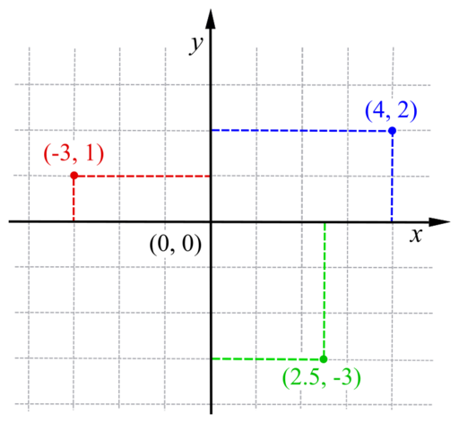
:::
:::

## Locations on a Globe

- The earth is not flat...


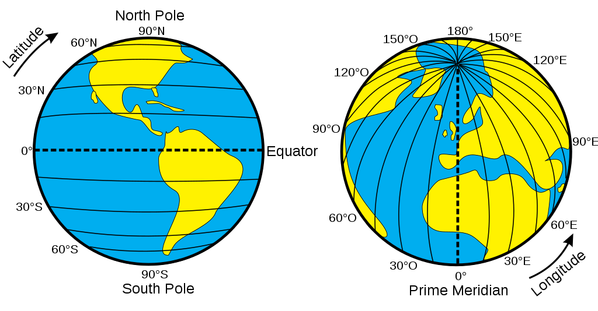

## Locations on a Globe

- The earth is not flat...

- Global Reference Systems (GRS)

- _Graticule_: the grid formed by the intersection of longitude and latitude

- The graticule is based on an ellipsoid model of earth's surface and contained in the _datum_


## Global Reference Systems
::: {style="font-size: 1.2em; text-align: center"}
__The *datum* describes which ellipsoid to use and relies on angular measurements to describe location on a sphere__
:::

- Geodetic datums (e.g., `WGS84`): distance from earth's center of gravity

- Local data (e.g., `NAD83`): better models for local variation in earth's surface

## Global Reference Systems

::: {.incremental}
* Great for _precise location_

* Great for _worldwide communication_

* Not great for measurements (e.g., distance, area)

* Inconsistent accuracy

:::


## Global Reference Systems

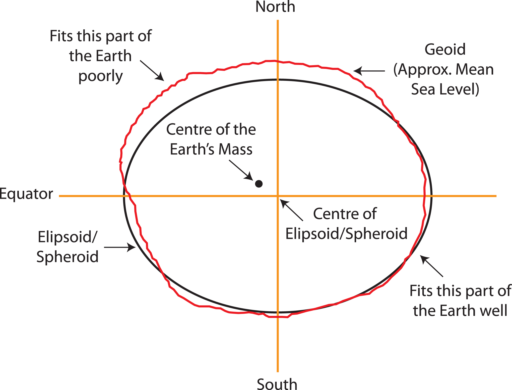

## The World Is Not Flat

::: columns
::: {.column width="60%"}
::: {style="font-size: 0.8em"} 
- But maps, screens, publications, and Cartesian Coordinates are...

- **Projections** describe *how* the data should be translated to a flat surface

- Rely on 'developable surfaces'

- Strictly: the mathematical function to transform the globe into the developable surface. 
:::
:::
::: {.column width="40%"}
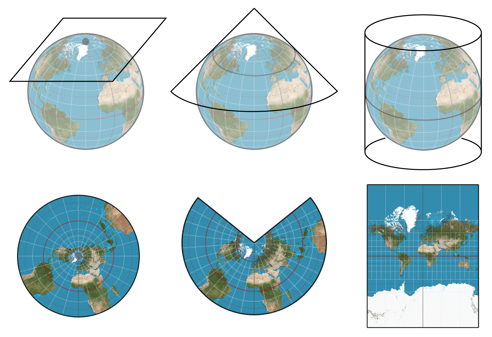
:::

:::

## Projections

It's just maths...

::: columns
::: {.column width="60%"}
::: {style="font-size: 0.7em"}

$$
\begin{aligned}
n &= \tfrac{1}{2}(\sin \phi_1 + \sin \phi_2) \\[4pt]
C &= \cos^2 \phi_1 + 2n \sin \phi_1 \\[4pt]
\rho(\phi) &= \frac{\sqrt{C - 2n \sin \phi}}{n}, \quad 
\rho_0 = \frac{\sqrt{C - 2n \sin \phi_0}}{n} \\[8pt]
x &= \rho(\phi)\,\sin\!\big(n(\lambda - \lambda_0)\big) \\[4pt]
y &= \rho_0 - \rho(\phi)\,\cos\!\big(n(\lambda - \lambda_0)\big)
\end{aligned}
$$

:::
:::
::: {.column width="40%"}
::: {style="font-size: 0.7em"}

$$
\begin{aligned}
\phi   &= \text{latitude} \\[4pt]
\lambda &= \text{longitude} \\[4pt]
\lambda_0 &= \text{central meridian} \\[4pt]
\phi_0 &= \text{latitude of origin} \\[4pt]
\phi_1, \phi_2 &= \text{standard parallels}
\end{aligned}
$$

:::
:::
:::

___

## Coordinate Reference System
 
 * Contains the full recipe for translating Earth to coordinates
 
 * Begin with a **datum** (model of spheroid Earth)
 
 * **Projection** - the math for flattening (e.g., Albers, Mercator, etc)
 
 * **Parameters** - the projection center, parallels, etc

## Coordinate Reference Systems

::: {style="font-size: 0.8em"}

-   Some projections minimize distortion of angle, area, or distance

-   Others attempt to avoid extreme distortion of any kind 

-   Includes: Datum, ellipsoid, units, and other information (e.g., False Easting, Central Meridian) to further map the projection to the GCS

-   Not all projections have/require all of the parameters
:::

## The Orange Peel Analogy

::: columns
::: {.column width="50%"}

A datum is the choice of fruit to use. Is the earth an orange, a lemon, a lime, a grapefruit?


:::
::: {.column width="50%"}

A projection is how you peel your orange and then flatten the peel.

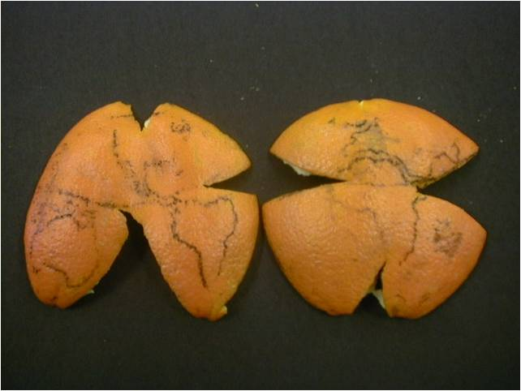

:::
:::

::: footer
Source: [Data Carpentry: Geospatial Concepts](https://datacarpentry.org/organization-geospatial/03-crs.html)
:::

## Projections are Political

```{r}
#| echo: false
#| eval: false

library(sf)             
library(rnaturalearth)  
library(dplyr)          
library(purrr)          
library(ggplot2)        
library(gganimate)      

world_orig = ne_countries(returnclass = "sf")
world_sel = world_orig %>% 
  select()
world = world_sel %>% 
  st_transform(crs = 3857)
world_areas = world %>% 
  st_transform(crs = "+proj=moll") %>% 
  st_area()
map_areas = world %>% 
  st_set_crs(NA) %>% 
  st_area()
world_scaled = world %>% 
  mutate(scale = 1 / (sqrt(map_areas / world_areas))) %>% 
  mutate(scale = as.numeric(scale / max(scale)))
scaler = function(x, y, z) {
  (x - z) * y + z
}

world_geom = st_geometry(world) 
world_center = st_centroid(world_geom)
world_transf = pmap(list(world_geom, world_scaled$scale, world_center), scaler) %>% 
  st_sfc(crs = st_crs(world)) %>% 
  st_sf()
world$state = 1
world_transf$state = 2
worlds = rbind(world, world_transf)


worlds_anim = ggplot() +
  geom_sf(data = worlds, fill = "grey50") +
  coord_sf(xlim = c(-20037508, 20037508), ylim = c(-21028681, 18440003))+
  transition_states(state, transition_length = 5, state_length = 2) + 
  ease_aes("cubic-in-out")

worlds_animate = animate(worlds_anim, nframes = 20)
anim_save("img/slide_8/worlds_animate.gif", worlds_animate)
```

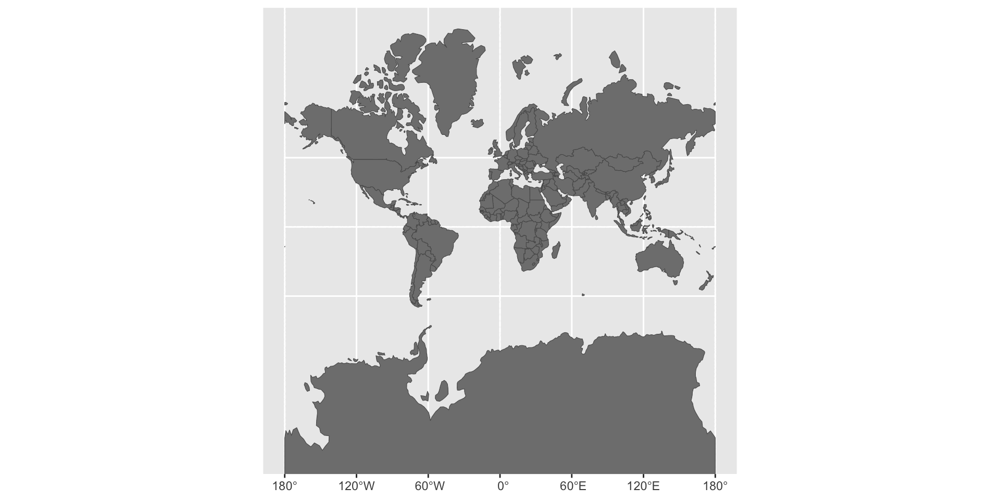

## Projections are Political

::: {style="font-size: 1.1em; margin-top: -0.5em; text-align: center"}
__Projection necessarily induces some form of distortion (tearing, compression, or shearing)__
:::

<div style="display: flex; justify-content: center; gap: 1em; margin-right: -3.0em; margin-left: -3.0em">
  <figure>
    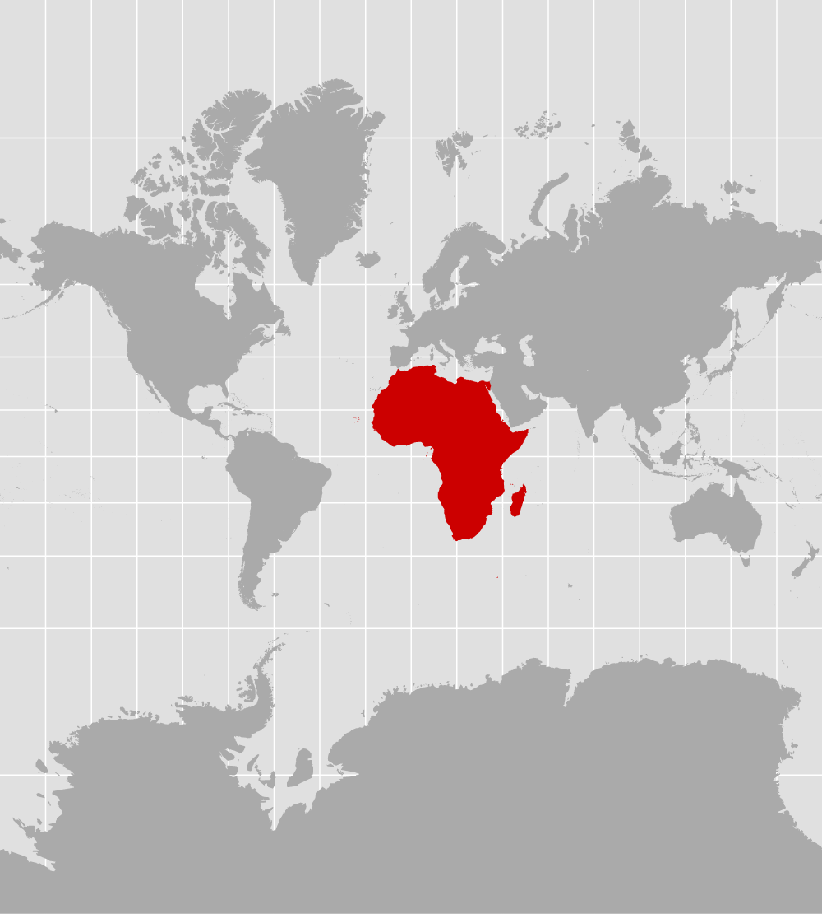
    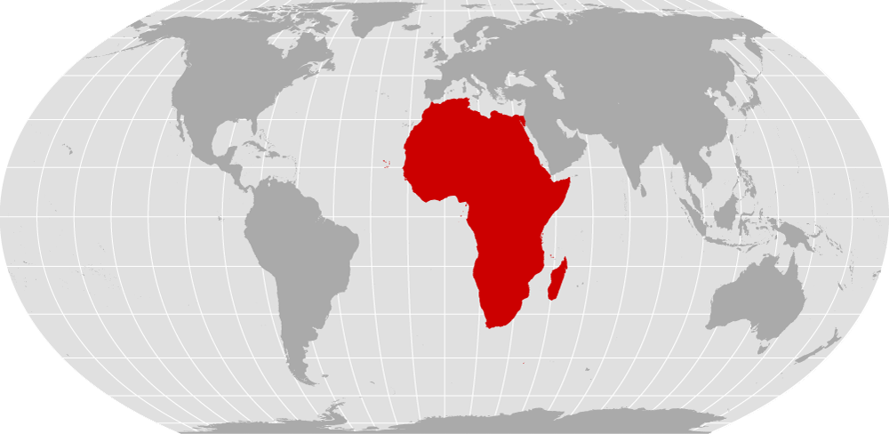
    <figcaption style="font-size: 0.8em"><a href="https://correctthemap.org/">Mercator vs. Equal Earth projection from Correct the Map</a></figcaption>
  </figure>  
</div>

## Projections are Political

::: columns
::: {.column width="40%"}
* Convey power through size

* Convey interest through focus

* Convey worldview through orientation

:::
::: {.column width="60%"}

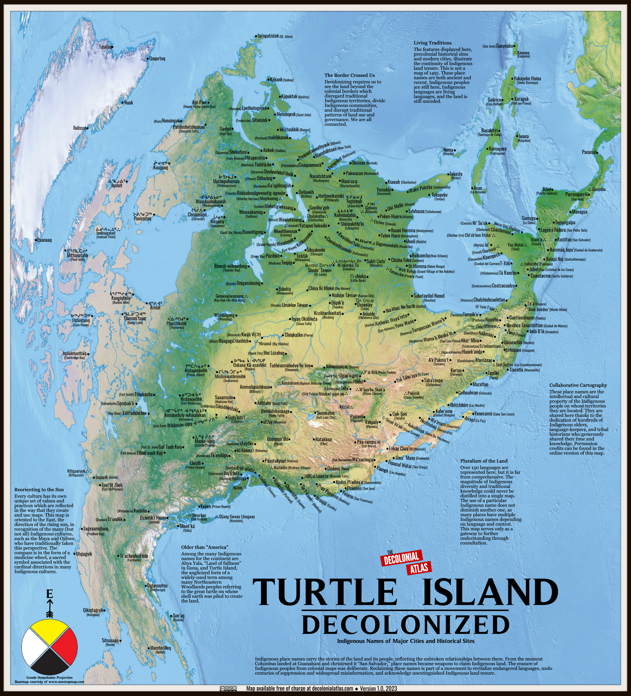
:::
:::

# Scale and Geographic Analysis

## Matching Inquiry to Process

<div style="display: flex; justify-content: center; gap: 1em; margin-right: -3.0em; margin-left: -3.0em;">
  <figure>
    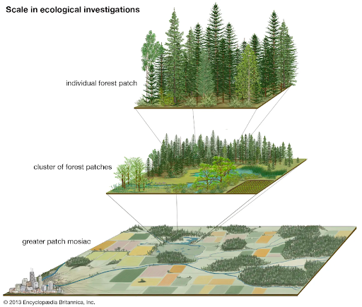
    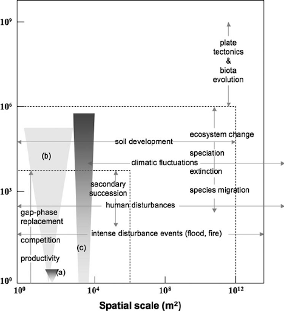
  </figure>  
</div>

## What do we even mean?

::: columns
::: {.column width="60%"}
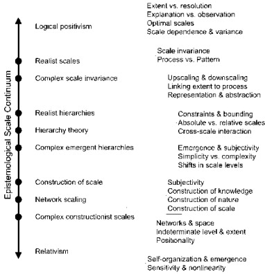{width=110%}
:::
::: {.column width="40%"}

- __Grain__: the smallest unit of measurement
- __Extent__: the areal coverage of the measurement

:::
:::
:::footnote
:::{style="font-size: 0.8em; margin-bottom: -1.em; color:#fff"}
From Manson 2008
:::
:::

## Scale
:::{style="font-size: 0.8em"}
Even if it exists, how do we know we are measuring at the _right_ scale?
:::

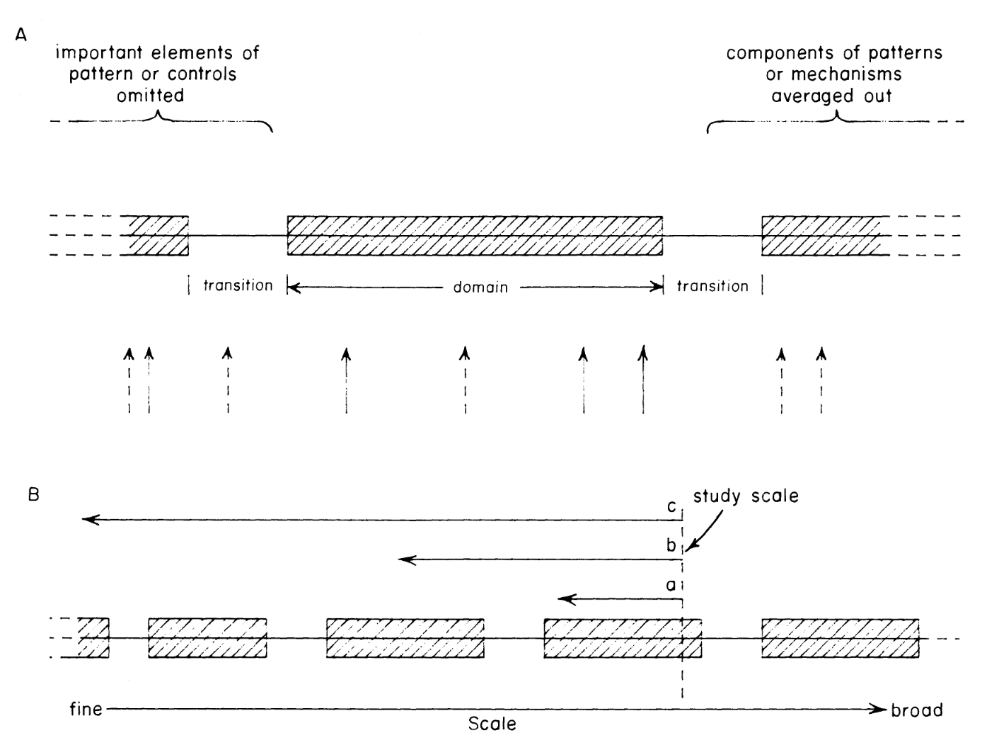{fig-align="center"}

## Fallacies

::: columns
::: {.column width="60%"}
- __Locational Fallacy:__ Error due to the spatial characterization chosen for elements of study


- __Atomic Fallacy:__ Applying conclusions from individuals to entire spatial units


- __Ecological Fallacy:__ Applying conclusions from aggregated information to individuals
:::
::: {.column width="40%"}
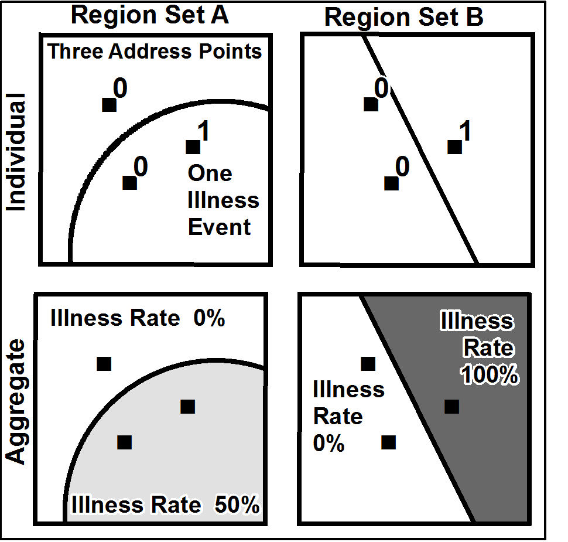
:::
:::

## In Practice

* Who chooses extent?

* How does aggregation affect the data?

* How spatially uniform is the underlying data?

* What can we change?

## In Practice

::: columns

:::
* Projection is not just a visual choice

* Aligning data is critical for robust analysis

* How might your choice of distortion affect your analysis

:::
:::

:::
:::