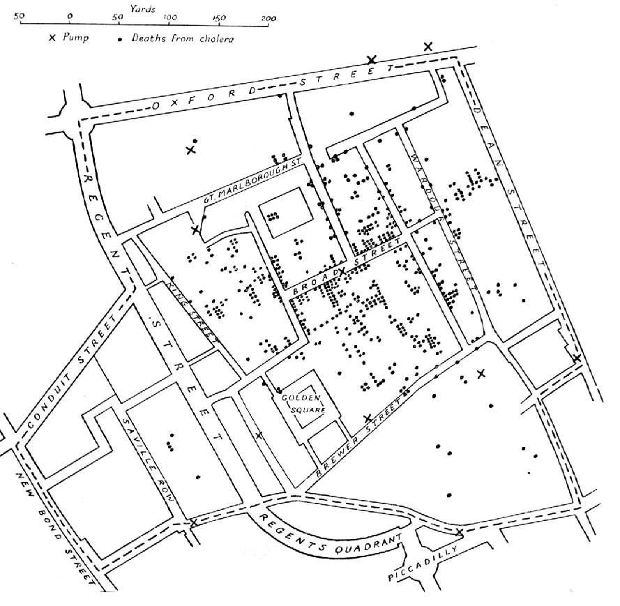
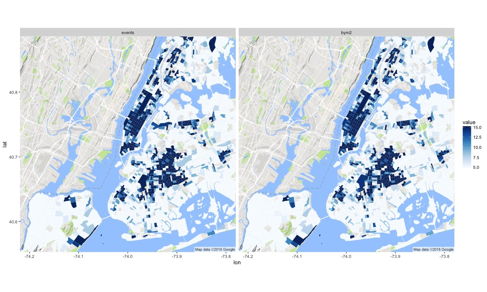
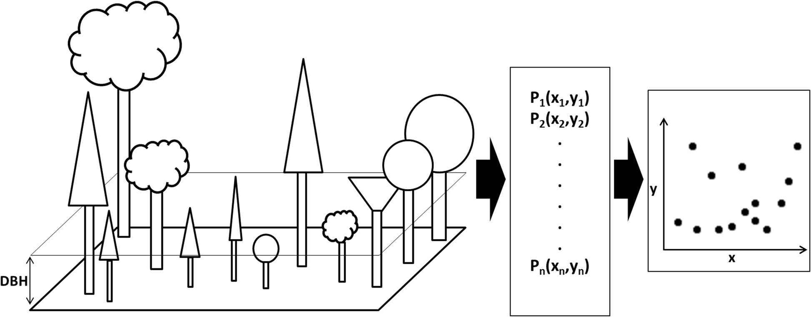

# Reminders

* Assignment 1 - Due **Sept 26**
* Final Project Contract - Due **Oct 01**
* Assignment 2 - Due **Oct 02**
* Assignment 1 Revision - Due **Oct 06**


# Today's Plan {background="#43464B" background-image="img/slide_14/bison.png"}


## Objectives

By the end of today, you should be able to:

- **Define** Spatial Analysis and distinguish it from making maps. 

- **Recognize** the role of database structure and spatial geometry in generating attributes

- **Develop** appreciation for the link between attribute operations and analysis validity. 

- **Perform** attribute operations on vector and raster data.


# What is spatial analysis?

## What is spatial analysis?
> "The process of examining the locations, attributes, and relationships of features in spatial data through overlay and other analytical techniques in order to address a question or gain useful knowledge. Spatial analysis extracts or creates new information from spatial data".
`r tufte::quote_footer('--- ESRI Dictionary')`

## What is spatial analysis?

::: columns
::: {.column width="60%"}

- The process of turning maps into information

- Any- or everything we do with GIS

- The use of computational and statistical algorithms to understand the relations between things that co-occur in space.
:::
::: {.column width="40%"}

:::
:::

## Common goals for spatial analysis

::: columns
::: {.column width="60%"}
](img/slide_14/stand-land_modeling_process_0.png){width=700, height=500}
:::
::: {.column width="40%"}

- Describe and visualize locations or events

- Quantify patterns

- Characterize 'suitability'

- Determine (statistical) relations
:::
:::

# 

:::{style="font-size: 1.4em; text-align: middle; margin-top: 2em"}
How did the data arise?
:::

## Spatial data as a stochastic process


:::{style="font-size: 1.4em; text-align: middle; margin-top: 2.5em"}

$$
{Z(\mathbf{s}): \mathbf{s} \in D \subset \mathbb{R}^d}
$$
:::

## Areal Data
:::{style="font-size: 1.4em; text-align: middle; margin-top: 1em"}
$$
{Z(\mathbf{s}): \mathbf{s} \in D \subset \mathbb{R}^d}
$$
:::

::: columns
::: {.column width="40%"}
- $D$ is fixed domain of countable units

- Typically involve some aggregation

:::
::: {.column width="60%"}
```{r}
#| echo: false
#| cache: true
#| message: false

library(sf)
library(tidyverse)
cejst <- st_read("/Users/mattwilliamson/Google Drive/My Drive/TEACHING/Intro_Spatial_Data_R/Data/2023/assignment01/cejst_nw.shp", quiet=TRUE) %>% 
  filter(!st_is_empty(.))

plot(cejst["EBLR_PFS"], main="Expected Annual Building Loss Rate")
```
:::
:::

## Geostatistical data

:::{style="font-size: 1.4em; text-align: middle; margin-top: 1em"}
$$
{Z(\mathbf{s}): \mathbf{s} \in D \subset \mathbb{R}^d}
$$
:::

::: columns
::: {.column width="60%"}

:::
::: {.column width="40%"}
- $D$ is a fixed subset of $\mathbb{R}^d$ 

- $Z(\mathbf{s})$ could be observed at any location within $D$.

- Models predict unobserved locations
:::
:::

## Point patterns

:::{style="font-size: 1.4em; text-align: middle; margin-top: -1em; margin-bottom: -1.25em"}
$$
{Z(\mathbf{s}): \mathbf{s} \in D \subset \mathbb{R}^d}
$$
:::

- $D$ is random; where $\mathbf{s}$ depicts the location of events



::: footer 
:::{style="font-size: 0.8em; margin-bottom: -1.5em; color:#fff"}
Ben-Said, M. Ecol Process 10, 56 (2021). 
:::
:::

# 
:::{style="font-size: 1.4em; text-align: middle; margin-top: 2em"}
Spatial analysis typically interested in the factors that contribute to $Z(\mathbf{s})$ or $D$ 
:::

## Common pitfalls of spatial analysis

- __Locational Fallacy:__ Error due to the spatial characterization chosen for elements of study


- __Atomic Fallacy:__ Applying conclusions from individuals to entire spatial units


- __Ecological Fallacy:__ Applying conclusions from aggregated information to individuals

::: {style="font-size: 0.7em"}
> Spatial analysis is an inherently complex endeavor and one that is advancing rapidly. So-called "best practices" for addressing many of these issues are still being developed and debated. This doesn't mean you shouldn't do spatial analysis, but you should keep these things in mind as you design, implement, and interpret your analyses
:::

## Avoiding pitfalls of spatial analysis

* Are the data aligned spatially and geometries accurate?

* How does the data relate to the process you are modelling?

* How does the process you are modeling align with the process that produced your data?