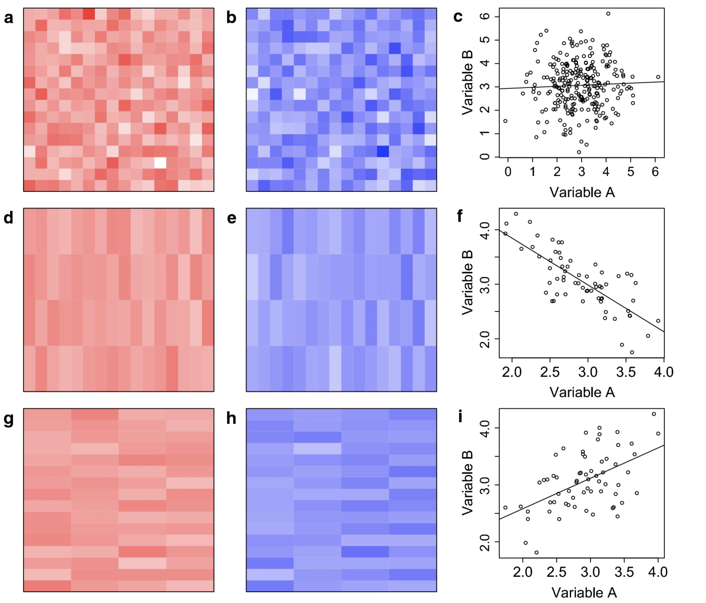
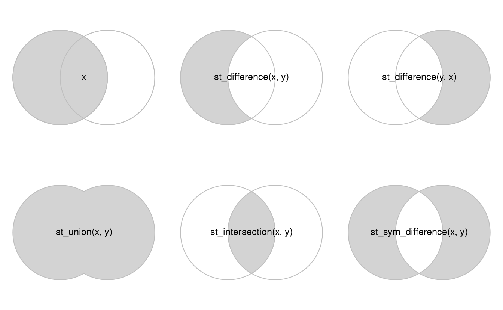

## Goals for Today

*  **Describe** the Modifiable Areal Unit Problem (MAUP).

*  **Link** the inferential problems of the ecological fallacy to the statistical problems of the MAUP.

*  **Modify** the geometries of spatial objects to explore the MAUP.

# Problems of Inference

* Atomic Fallacy

* Ecological Fallacy

# Problems of Analysis

## MAUP and the Ecological Fallacy

* Modifiable Areal Unit Problem (MAUP)

* Statistical relations depend on boundaries

* (One) Indicator of the ecological fallacy

## MAUP and the Ecological Fallacy



# Modifying Spatial Objects

## Changing geometries with `sf`

## Revisiting `predicates` and `measures`

- __Predicates__: evaluate a logical statement asserting that a property is `TRUE` 

- __Measures__: return a numeric value with units based on the units of the CRS

- Unary, binary, and n-ary distinguish how many geometries each function accepts and returns

## Transformations

::: {style="font-size: 0.7em"}
- __Transformations__: create new geometries based on input geometries
:::
::: columns
::: {.column width="50%"}

```{r}
#| echo: false
#| message: false
library(sf)
library(spData)
library(tidyverse)
seine_simp = st_simplify(seine, dTolerance = 5000)  # 2000 m


par(mfrow=c(1,2))
plot(seine, main="Original Data")
plot(seine_simp, main="Simplified")

```

:::
::: {.column width="50%"}

```{r}
#| message: false
nc <- st_read(system.file("shape/nc.shp", package="sf"), quiet = TRUE)

plot(st_geometry(nc))
plot(st_geometry(st_centroid(nc)), add=TRUE, col='red')
par(mfrow=c(1,1))
```
:::
:::
  
## Unary Transformations

::: {style="font-size: 0.4em"}

|transformer               |returns a geometry ...                                                              |
|--------------------------|----------------------------------------------------------------------------------|
|`centroid`|of type `POINT` with the geometry's centroid|
|`buffer`|that is larger (or smaller) than the input geometry, depending on the buffer size|
|`jitter` |that was moved in space a certain amount, using a bivariate uniform distribution|
|`wrap_dateline`|cut into pieces that do no longer cover the dateline|
|`boundary`|with the boundary of the input geometry|
|`convex_hull`|that forms the convex hull of the input geometry|
|`line_merge`|after merging connecting `LINESTRING` elements of a `MULTILINESTRING` into longer `LINESTRING`s.|
|`make_valid`|that is valid |
|`node`|with added nodes to linear geometries at intersections without a node; only works on individual linear geometries|
|`point_on_surface`|with a (arbitrary) point on a surface|
|`polygonize`|of type polygon, created from lines that form a closed ring|
:::

## Other Unary Transformations 

::: {style="font-size: 0.4em"}
|transformer               |returns a geometry ...                                                              |
|--------------------------|----------------------------------------------------------------------------------|
|`segmentize`|a (linear) geometry with nodes at a given density or minimal distance|
|`simplify`|simplified by removing vertices/nodes (lines or polygons)|
|`split`|that has been split with a splitting linestring|
|`transform`|transformed or convert to a new coordinate reference system (chapter \@ref(cs))|
|`triangulate`|with Delauney triangulated polygon(s) (figure \@ref(fig:vor))|
|`voronoi`|with the Voronoi tessellation of an input geometry (figure \@ref(fig:vor))|
|`zm`|with removed or added `Z` and/or `M` coordinates|
|`collection_extract`|with subgeometries from a `GEOMETRYCOLLECTION` of a particular type|
|`cast`|that is converted to another type|
|`+`|that is shifted over a given vector|
|`*`|that is multiplied by a scalar or matrix|
:::

# Binary Transformers 

## Binary Transformers
::: {style="font-size: 0.4em"}

|function           |returns                                                    |infix operator|
|-------------------|-----------------------------------------------------------|:------------:|
|`intersection`     |the overlapping geometries for pair of geometries          |`&`|
|`union`            |the combination of the geometries; removes internal boundaries and duplicate points, nodes or line pieces|`|`|
|`difference`       |the geometries of the first after removing the overlap with the second geometry|`/`|
|`sym_difference`   |the combinations of the geometries after removing where they intersect; the negation (opposite) of `intersection`|`%/%`|
| `crop`            | crop an sf object to a specific rectangle |
:::

## Binary Transformers


## Common Uses of Binary Transformers

* Relating partially overlapping datasets to each other

* Reducing the extent of vector objects

## N-ary Transformers

* Similar to Binary (except `st_crop`)

* `union` can be applied to a set of geometries to return its
geometrical union

* `intersection` and `difference` take a single argument,
but operate (sequentially) on all pairs, triples, quadruples, etc.

## Changing geometries with `terra`

* Changing pixel size with `aggregate` and `disagg` (leaves CRS unchanged)


* Dramatic changes and more sophisticated downsampling with `resample`
