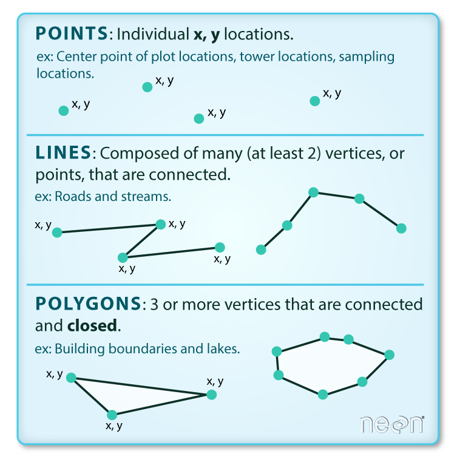
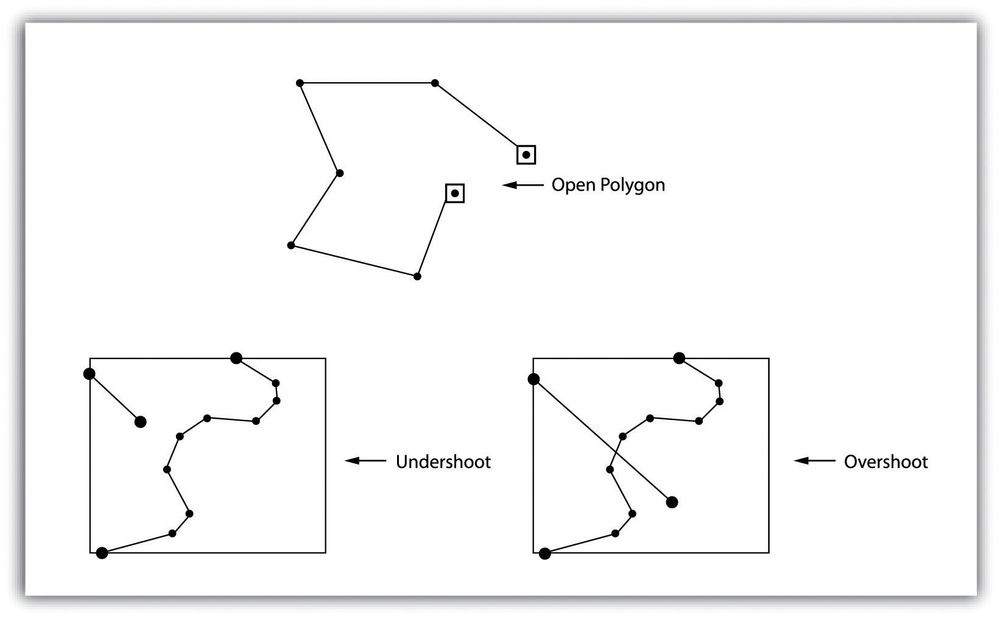
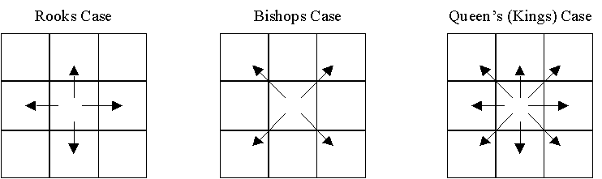

## The Vector Data Model

::: columns
::: {.column width="60%"}
::: {style="font-size: 0.8em"} 
- Coordinates define the __Vertices__ (i.e., discrete x-y locations) that comprise the geometry

- The organization of those vertices define the _shape_ of the vector

- General types: points, lines, polygons
:::
:::
::: {.column width="40%"}

:::
:::


## Representing vector data in R

::: columns
::: {.column width="40%"}

:::
::: {.column width="60%"}
::: {style="font-size: 0.8em"} 
* `sf` hierarchy reflects increasing complexity of geometry
  * `st_point`, `st_linestring`, `st_polygon` for single features
  * `st_multi*` for multiple features of the same type
  * `st_geometrycollection` for multiple feature types
  * `st_as_sfc` creates the geometry list column for many `sf` operations
:::
:::
:::

## Revisiting Simple Features
::: columns
::: {.column width="40%"}
::: {style="font-size: 0.7em"} 
- The `sf` package relies on a simple feature data model to represent geometries
  - hierarchical
  - standardized methods
  - complementary binary and human-readable encoding
:::
:::
::: {.column width="60%"}
::: {style="font-size: 0.5em"} 
| type                      | description                                                               |
|---------------------------|---------------------------------------------------------------------------|
| `POINT`                   | single point geometry |
| `MULTIPOINT`              | set of points |
| `LINESTRING`              | single linestring (two or more points connected by straight lines) |
| `MULTILINESTRING`         | set of linestrings |
| `POLYGON`                 | exterior ring with zero or more inner rings, denoting holes |
| `MULTIPOLYGON`            | set of polygons |
| `GEOMETRYCOLLECTION`      | set of the geometries above  |
:::
:::
:::

## Standaridized Methods
:::{style="font-size: 0.8em; text-align: middle"}
We can categorize `sf` operations based on what they return and/or how many geometries they accept as input.
:::

::: columns
::: {.column width="50%"}
::: {style="font-size: 0.7em"} 
- *Output Categories*
  - __Predicates__: evaluate a logical statement asserting that a property is `TRUE` 

  - __Measures__: return a numeric value with units based on the units of the CRS

  - __Transformations__: create new geometries based on input geometries.

:::
:::

::: {.column width="50%"}
::: {style="font-size: 0.7em"}
- *Input Geometries*

  - __Unary__: operate on a single geometry at a time (meaning that if you have a `MULTI*` object the function works on each geometry individually)
  - __Binary__: operate on pairs of geometries
  - __n-ary__: operate on sets of geometries

:::
:::
:::

## Common Problems with Vector Data

::: columns
::: {.column width="60%"}
::: {style="font-size: 0.8em"} 
 * Vectors and scale
 
 * Slivers and overlaps 
 
 * Undershoots and overshoots
 
 * Self-intersections and rings
:::
:::
::: {.column width="40%"}

:::
:::

:::{style="font-size: 1.2em; text-align: middle"}
We'll use `st_is_valid()` (a _predicate_) to check this, but fixing can be tricky
:::

## Fixing Problematic Topology

* `st_make_valid()` (a _transformer_) for simple cases

* `st_buffer` (also a _transformer_) with `dist=0` 

## Fixing geometries

- When `all(st_is_valid(your.shapefile))` returns `FALSE`

::: columns
::: {.column width=40%}
::: {style="font-size: 0.8em"}
- `st_make_valid` has two methods: 
  -   original converts rings into noded lines and extracts polygons
  -   structured makes rings valid first then merges/subtracts from existing polgyons
  
:::
:::
::: {.column width=60%}
```{r}
#| echo: fenced

library(sf)
x = st_sfc(st_polygon(list(rbind(c(0,0),c(0.5,0),c(0.5,0.5),c(0.5,0),c(1,0),c(1,1),c(0,1),c(0,0)))))
st_is_valid(x)
```

```{r}
#| fig-width: 6

plot(x)
```
:::
:::

## Fixing geometries with `st_make_valid`

::: columns
::: {.column width="40%"}
```{r}
#| fig-width: 7
y <- x %>% st_make_valid()
plot(y)
```
:::
::: {.column width="60%}
```{r}
#| echo: fenced

y <- x %>% st_make_valid()
st_is_valid(y)
```
:::
:::


## Fixing Geometries with `st_buffer`

::: columns
:::{.column width=40%}
-`st_buffer` enforces valid geometries as an output

- Setting a 0 distance buffer leaves most geometries unchanged

- Not all transformations do this
:::
:::{.column width="60%"}

```{r}
#| echo: fenced

z <- x %>% st_buffer(., dist=0)

st_is_valid(z)
```

```{r}
#| fig-width: 7
plot(z)
```
:::
:::

## Revisiting the Raster Data Model

::: columns
:::{.column width="50%"}
::: {style="font-size: 0.7em"}
*   __Vector data__ describe the "exact" locations of features on a landscape (including a Cartesian landscape)

* __Raster data__ represent spatially continuous phenomena (`NA` is possible)

* Depict the alignment of data on a regular lattice (often a square)
  * Operations mimic those for `matrix` objects in `R` 

* Geometry is implicit; the spatial extent and number of rows and columns define the cell size
:::
:::
::: {.column width="50%"}
```{r}
#| fig-height: 6
#| fig-width: 6
library(terra)
filename <- system.file("ex/elev.tif", package="terra")
r <- rast(filename)
plot(r, col=gray(0:1000/1000), main = "Elevation (m)")
```
:::
:::

## Rasters with `terra`

* syntax is different for `terra` compared to `sf`

* Representation in `Environment` is also different

* Can break pipes, __Be Explicit__

# Rasters by Construction

## Rasters by Construction

::: columns
::: {.column width="50%"}
```{r}
#| echo: true
mtx <- matrix(1:16, nrow=4)
mtx
rstr <- terra::rast(mtx)
rstr
```
:::
::: {.column width="50%"}
```{r}
#| fig-width: 6
#| fig-height: 6
plot(rstr)
```
:::
:::
::: {style="font-size: 0.5em"}
Note: you must have `raster` or `terra` loaded for `plot()` to work on `Rast*` objects; otherwise you get `Error in as.double(y) : cannot coerce type 'S4' to vector of type 'double'`
:::

## Rasters by Construction: Origin

* Origin defines the location of the intersection of the x and y axes

::: columns
::: {.column width="50%"}
```{r}
#| echo: true
r <- rast(xmin=-4, xmax = 9.5, ncols=10)
r[] <- runif(ncell(r))
origin(r)
r2 <- r
origin(r2) <- c(2,2) 
```
:::
::: {.column width="50%"}
```{r}
#| fig-width: 6
#| fig-height: 6
par(mfrow = c(2,1))
plot(r, xlim = c(-1, 6), ylim=c(0,7), main = "Original")
plot(r2, xlim = c(-1, 6), ylim=c(0,7), main = "New Origin")
par(mfrow=c(1,1))
```
:::
:::

## Rasters by Construction: Resolution
::: {style="font-size: 0.7em"}
* Geometry is implicit; the spatial extent and number of rows and columns define the cell size
* __Resolution__ (`res`) defines the length and width of an individual pixel
:::

::: columns
::: {.column width="50%"}
```{r}
#| echo: true
r <- rast(xmin=-4, xmax = 9.5, 
          ncols=10)
res(r)
r2 <- rast(xmin=-4, xmax = 5, 
           ncols=10)
res(r2)
```
:::
::: {.column width="50%"}
```{r}
#| echo: true
r <- rast(xmin=-4, xmax = 9.5, 
          res=c(0.5,0.5))
ncol(r)
r2 <- rast(xmin=-4, xmax = 9.5, 
           res=c(5,5))
ncol(r2)
```
:::
:::

# Predicates and measures in `terra` 

## Extending predicates

- __Predicates__: evaluate a logical statement asserting that a property is `TRUE` 

- `terra` does not follow the same hierarchy as `sf` so a little trickier

## Unary predicates in `terra`

* Can tell us qualities of a raster dataset

* Many similar operations for `SpatVector` class (note use of `.`)

::: {style="font-size: 0.7em"}
|predicate            |asks...                                                  |
|---------------------|--------------------------------------------------------------|
|`is.lonlat`             |Does the object have a longitude/latitude CRS?|
|`inMemory`              |is the object stored in memory?|
|`is.factor`              |Are there categorical layers?|
|`hasValues`              |Do the cells have values?|
:::

## Unary predicates in `terra`

::: columns
:::{.column width="50%"}
::: {style="font-size: 0.7em"}
* `global`: tests if the raster covers all longitudes (from -180 to 180 degrees) such that the extreme columns are in fact adjacent

```{r}
#| echo: true
r <- rast()
is.lonlat(r)
is.lonlat(r, global=TRUE)
```
:::
:::
::: {.column width="50%"}
::: {style="font-size: 0.7em"}
* `perhaps`: If TRUE and the crs is unknown, the method returns TRUE if the coordinates are plausible for longitude/latitude

```{r}
#| echo: true
crs(r) <- ""
is.lonlat(r)
is.lonlat(r, perhaps=TRUE, warn=FALSE)
```


```{r}
#| echo: true
crs(r) <- "+proj=lcc +lat_1=48 +lat_2=33 +lon_0=-100 +ellps=WGS84"
is.lonlat(r)
```
:::
:::
:::

## Binary predicates in `terra`

* Take exactly 2 inputs, return 1 matrix of cell locs where value is `TRUE`

* `adjacent`: identifies cells adajcent to a set of raster cells



## Unary measures in `terra`

* Slightly more flexible than `sf` 

* One result for each layer in a stack

::: {style="font-size: 0.5em"}
|measure              |returns                                                       |
|---------------------|--------------------------------------------------------------|
|`cellSize`          |area of individual cells|
|`expanse`               |summed area of all cells|
|`values`             |returns all cell values|
|`ncol`             |number of columns|
|`nrow`             |number of rows|
|`ncell`             |number of cells|
|`res`             |resolution|
|`ext`             |minimum and maximum of x and y coords|
|`origin`             |the orgin of a `SpatRaster`|
|`crs`             |the coordinate reference system|
|`cats`             |categories of a categorical raster|
:::

## Binary measures in `terra`

* Returns a matrix or `SpatRaster` describing the measure

::: {style="font-size: 0.5em"}
|measure              |returns                                                       |
|---------------------|--------------------------------------------------------------|
|`distance`          |shortest distance to non-NA or vector object|
|`gridDistance`               |shortest distance through adjacent grid cells|
|`costDistance`             |Shortest distance considering cell-varying friction|
|`direction`             |azimuth to cells that are not `NA`|
:::
