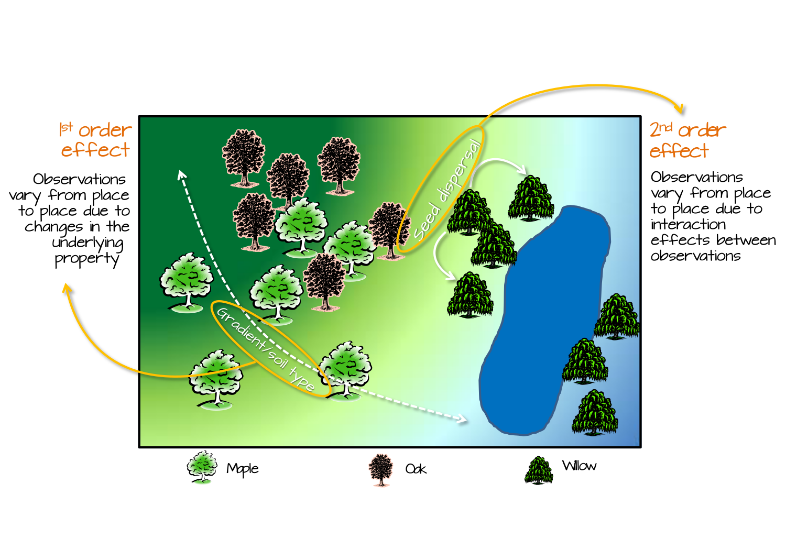
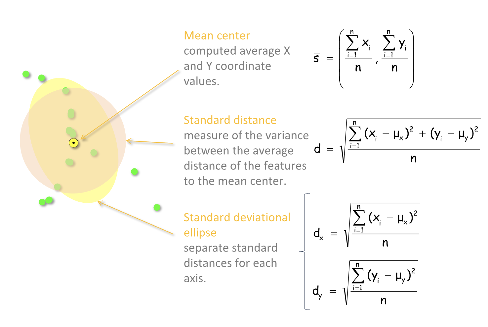
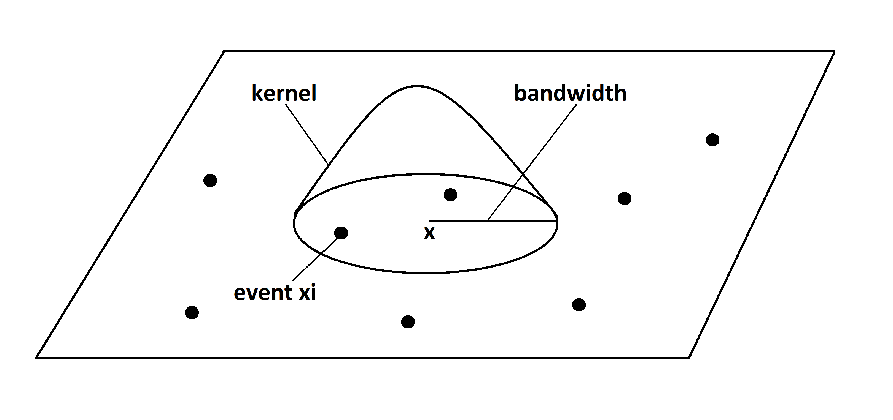

```{r}
#| include: false
library(tidycensus)
library(sf)
library(tidyverse)
library(socviz)
library(maps)
library(tmap)
library(spData)
library(terra)
library(spatstat)
library(tmap)
library(gstat)
```

## Update on Assignments

* Updated (clarified) process:

  * You submit (commit) your first version
  * I'll post the key
  * You update your assignment highlighting any areas you still feel unsure about
  * I'll annotate your repo with feedback

## Update on Assignments

* Key to Assignments 1 and 2 posted by Oct 15.

* Revisions Due by Nov 1. 

* Key to Assignment 3 posted by Oct 27.

* Revision due Nov 12

# Point Patterns


## Objectives 

- Define a point process 

- Define Complete Spatial Randomness

- Distinguish First and Second-Order CSR

- Introduce density-based methods for describing point patterns

## What is a point pattern?

::: columns
::: {.column width="60%"}
::: {style="font-size: 0.7em"}
* _Point pattern_: A __set__ of __events__ within a study region (i.e., a _window_) generated by a random process

* __Set__: A collection of mathematical __events__

* __Events__: The existence of a point object of the type we are interested in at a particular location in the study region

* A _marked point pattern_ refers to a point pattern where the events have additional descriptors

:::
:::
::: {.column width="40%"}
::: {style="font-size: 0.7em"}
__Some notation:__

* $S$: refers to the entire set

* $\mathbf{s_i}$ denotes the vector of data describing point $s_i$ in set $S$

* $\#(S \in A )$ refers to the number of points in $S$ within study area $A$
:::
:::
:::

## Requirements for a set to be considered a point pattern

* The pattern must be mapped on a plane to preserve distance

* The study area, $A$, should be objectively determined

* There should be a $1:1$ correspondence between objects in $A$ and events in the pattern

* Events must be _proper_ i.e., refer to actual locations of the event

* For some analyses the pattern should be a census of the relevant events

## Describing Point Patterns

<div style="display: flex; justify-content: center; margin-top: -0.8em">
  
</div>


::: {style="font-size: 0.7em"}

* _First order_ effects reflect variation in __intensity__ due to variation in the 'attractiveness' of locations (density)

* _Second order_ effects reflect variation in __intensity__ due to the presence of points themselves (distance)

:::

## Basic Descriptions: Centrography

<div style="display: flex; justify-content: center">
  
</div>


# Analyzing Point Patterns

## 3 Flavors of Point Pattern Analysis

* Modeling random processes means we are interested in probability densities of the points (first-order;density)

* Also interested in how the presence of some events affects the probability of other events (second-order;distance)

* Finally interested in how the attributes of an event affect location (marked)

* Need to introduce a few new packages (`spatstat` and `gstat`)

## First Order Analsyis: CSR

* Homogeneous Poisson Process:
  * All events have an equal likelihood of occurring anywhere
  * Point locations are independent (no attraction/repulsion)
  * Given a rate ($\lambda$) we can estimate the expected number of points

## Density based methods

::: columns
::: {.column width="60%"}

*   The overall _intensity_ of a point pattern is a crude density estimate
*   Local density = quadrat counts

$$
\begin{equation}
\hat{\lambda} = \frac{\#(S \in A )}{a}
\end{equation}
$$

:::
::: {.column width="40%"}
```{r}
#| fig-width: 5
#| fig-height: 5
nclust <- function(x0, y0, radius, n) {
              return(runifdisc(n, radius, centre=c(x0, y0)))
            }
x <- rpoispp(lambda =50)
Q = quadratcount(x)
plot(x, main="")
plot(Q, add=TRUE)
```
:::
:::

## Quadrat Counts and CSR

* Observed vs. Expected

* $\chi^2$ test 


## Kernel Density Estimates (KDE)

$$
\begin{equation}
\hat{f}(x) = \frac{1}{nh_xh_y} \sum_{i=1}^n k\bigg(\frac{{x-x_i}}{h_x},\frac{{y-y_i}}{h_y} \bigg)
\end{equation}
$$

::: {style="font-size: 0.7em"}
* Assume each location in $\mathbf{s_i}$ drawn from unknown distribution

* Distribution has probability density $f(\mathbf{x})$

* Estimate $f(\mathbf{x})$ by averaging probability "bumps" around each location

* Need different object types for most operations in `R` (`as.ppp`)

:::

## Kernel Density Estimates (KDE)
<div style="display: flex; justify-content: center; margin-top: -0.8em">
  
</div>


## Kernel Density Estimates (KDE)

$$
\begin{equation}
\hat{f}(x) = \frac{1}{nh_xh_y} \sum_{i=1}^n k\bigg(\frac{{x-x_i}}{h_x},\frac{{y-y_i}}{h_y} \bigg)
\end{equation}
$$

::: {style="font-size: 0.7em"}
* $h$ is the bandwidth and $k$ is the kernel

* We can use `stats::density` to explore

* __kernel__: defines the shape, size, and weight assigned to observations in the window

* __bandwidth__ often assigned based on distance from the window center

:::

## Bandwidth Matters (more than kernel shape)

* Look at `?density` to see all the kernel options!

```{r}
#| echo: true
x <- rpoispp(lambda =50)
K1 <- density(x, bw=2)
K2 <- density(x, bw=10)
K3 <- density(x, bw=2, kernel="disc")
```

```{r}
#| fig-width: 18

par(mfrow=c(1,3))
plot(K1, main="Bandwidth=2")
plot(K2, main="Bandwidth=10")
plot(K3, main="Bandwidth=2, kernel=disc")
par(mfrow=c(1,1))
```

## Choosing bandwidths and kernels

* Small values for $h$ give 'spiky' densities

* Large values for $h$ smooth much more

* Some kernels have optimal bandwidth detection


